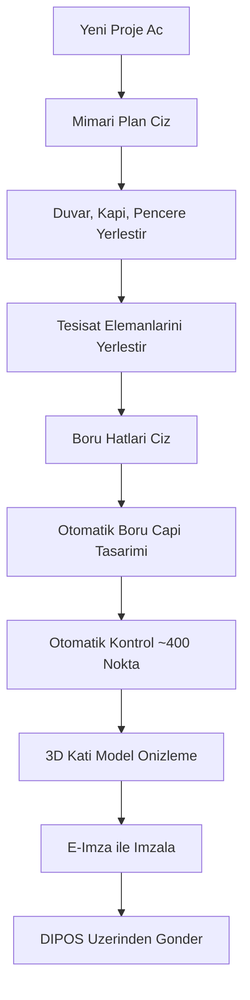

# Genel Bakis

## ZetaCAD Nedir?

ZetaCAD, bir **Tekhnelogos** markasi olup dogalgaz tesisat projelerinin mimari planla birlikte otomatik olarak tasarlanmasini, hesaplanmasini ve kontrolunu saglayan **yapay zeka temelli bir e-proje yazilimi**dir. Istanbul merkezli Tekhnelogos firmasi tarafindan 1997'lerin basindan beri gelistirilmektedir.

ZetaCAD sadece dogalgaz proje telifi yapabilmek icin gelistirilmis bir programdir. Tek amaci vardir ve tum fonksiyonlarini bu amaca gore organize eder.

## Standart CAD'den Farki

Standart bir CAD programinda cizim genel amacli primitif nesneler (cizgi, daire, dikdortgen) ile yapilir. Bu nesneler arasinda anlam farki yoktur -- bir duvarin cizgisi ile bir dogalgaz hattinin cizgisi ayni seydir.

ZetaCAD'de ise primitif cizim nesneleri yoktur. Bunlarin yerine **ozellestirilmis ve gelismis tanimli nesneler ve komutlar** vardir. ZetaCAD icin duvar duvardIr, hat hattir. Bunlar birbirinden kesin tanimlarla ayrilir. Bu sayede program, proje ile ilgili yapilmasi gereken tum hesaplama ve kontrolleri otomatik olarak yapabilir.

## Temel Is Akisi

## Yapay Zeka Destegi

ZetaCAD'in diger cizim programlarindan en temel farki, sahip oldugu **yapay zekasi** ile projenin butun unsurlarini kontrol edebilmesidir. Muelllifin zihninde hangi anlam ve kasit varsa, ayni sey ZetaCAD'in yapay zekasinda da vardir.

Program, projeyle ilgili yapilmasi gereken tum hesaplama ve kontrolleri kendisi otomatik olarak yapar. Tamamlanan veya tamamlanmakta olan projenin, hicbir insan inisiyatifine ihtiyac duymadan ilgili teknik sartnameye gore kontrolu tam olarak saglanir.

## Proje Tipleri

| Proje Tipi | Aciklama |
|-----------|----------|
| Kolon Projeleri | Bina kolon tesisat projeleri |
| Ic Tesisat Projeleri | Daire ici dogalgaz tesisat projeleri |
| Kolon + Ic Tesisat | Her iki proje tipinin birlikte hazirlanmasi |
| Merkezi Sistem Projeleri | Merkezi isitma sistemi projeleri |
| Teknik Tadilat Projeleri | Mevcut tesisatin tadilat projeleri |
| Kucuk Sanayi Tipi | Endustriyel dogalgaz projeleri |

Tum dusuk basinc (21-50 mbar) ve orta basinc (50-300 mbar) dogalgaz tesisati projeleri tasarlanabilir.

## Hiz Avantaji

ZetaCAD 3.0 ile proje telifi:

- Diger programlara gore **4 kat** daha hizli
- Elle telife gore **10 kat** daha hizli
