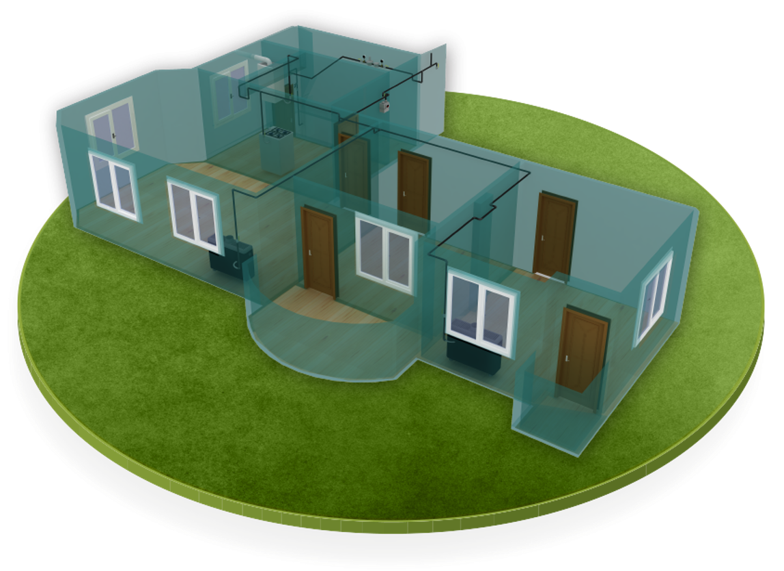
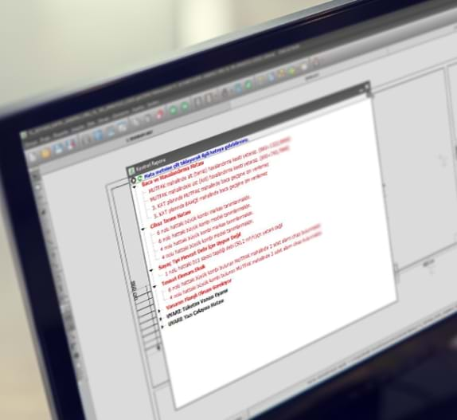

ZetaCAD, doğal gaz tesisat projelerinin çizimi, hesaplanması, kontrol edilmesi ve dijital olarak gönderilmesini sağlayan uzmanlaşmış bir CAD mühendislik yazılımıdır.

{width="300" }

## ZetaCAD Neleri Kontrol Eder?

Doğal gaz tesisat tasarımında, hesaplamasında ve kontrolünde, ilgili gaz dağıtım firmasının son güncel şartnamesi ve buna bağlı teknik yayın ve bildirimlerini esas alarak doğalgaz projesini en doğru biçimde ortaya koyar. Bir projenin hatasız olarak telif edilebilmesi için ZetaCAD bir çok kategoride yaklaşık 400 noktadan bir projeyi kontrol eder.

!!! tip "Diğer Programlar genel amaçlıdır. ZetaCAD özel amaçlıdır"

    Standart CAD programları çoğunluka genel amaçlıdır. ZetaCAD sadece doğalgaz proje telifi yapabilmek için geliştirilmiş bir programdır. Tek amacı vardır ve tüm fonksiyonlarını bu amaca göre organize eder.

 

## Akıllı Kontrol

ZetaCAD’in yapay zeka temelli alt yapısının en güçlü şekilde kendini gösterdiği nokta, projenin otomatik kontrolüdür. E-Proje standartlarının da en önemli unsuru olan otomatik kontrol, tamamlanan veya tamamlanmakta olan ZetaCAD projesinin, hiç bir insan inisiyatifine ihtiyaç duymadan ilgili teknik şartnamelere göre kontrolünün tam olarak sağlanmasıdır. Program projenin şartnameyle uyumsuz olan en ufak hatasını dahi fark ederek uyarır ve hatanın düzeltilmesi için gerekli yolları önerir. Bunlar hesaplama sonucu ortaya çıkan basit hız veya basınç kaybı hataları olabildiği gibi, ancak bir insanın akıl yürütme yoluyla ortaya çıkarabileceği karmaşık hatalar da olabilir. Otomatik dijital kontrol, projelerin hatasız olarak telif edilmelerini sağlar, öte yandan proje kontrolü yapan onay mühendislerinin projeleri otomatik olarak kontrol edebilmelerini sağlar.

!!! info "İlkel çizim nesneleri yerine; Gelişmiş Çizim Nesneleri"
    Standart bir CAD programında çizim genel amaçlı ilkel nesneler ile yapılır. Bunlar çizgi, daire, dörtgen, eğri gibi temel çizim nesneleridir. ZetaCAD’de özelleşmiş ve gelişmiş tanımlı nesneler ve komutlar vardır.

<!-- {width="500" } -->

 

## Akıllı Tasarım

Standart bir Cad programında, çizilen tasarımın program için bir anlamı yoktur. Tasarımla ilgili bütün bilgi kullanıcının zihnindedir. ZetaCAD’de ise ortaya çıkan proje telifinin her türlü bilgisine program hakimdir. ZetaCAD’de her şey sıkı tanımlarla ayrışmış ve amacına yöneliktir. Bu bağlamda program proje ile ilgili yapılması gereken tüm hesaplama ve kontrolleri kendisi otomatik olarak yapar. Nitekim ZetaCAD projenin bütününe hakimdir. ZetaCAD’de kolon projeleri, iç tesisat projeleri, merkezi sistem projeleri, teknik tadilat projeleri, küçük sanayi tipi projeleri gibi, 21 mbar'dan 4 bara kadar tüm doğal gaz tesisatı projelerini tasarlayabilirsiniz..

<!-- {width="500" } -->

