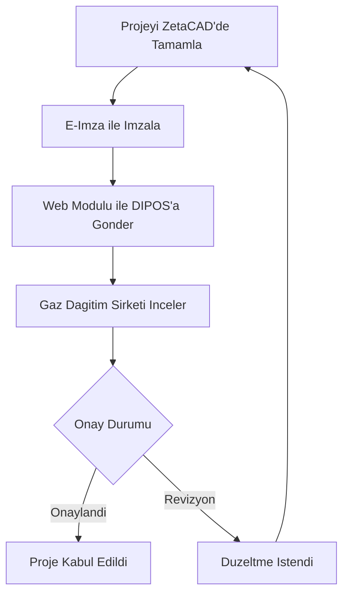

# DIPOS - Dijital Proje Onay Sistemi

ZetaCAD, **DIPOS (Dijital Proje Onay Sistemi)** ile entegre calisarak projelerin dijital ortamda onaylanmasini saglar.

## DIPOS Nedir?

DIPOS, dogalgaz tesisat projelerinin gaz dagitim sirketlerine dijital ortamda gonderilmesini ve onaylanmasini saglayan bir sistemdir. ZetaCAD'in **Web Modulu** ile DIPOS entegrasyonu saglanir.

## Web Modulu

ZetaCAD Web Modulu, ZetaCAD Studio'dan ayri olarak kurulur ve asagidaki islevleri saglar:

- Projelerin DIPOS'a gonderilmesi
- Proje durumunun takibi
- Onay surecinin yonetimi

## Is Akisi

## Kurulum

Web Modulu kurulumu icin:

1. Size gonderilen **ZetaCAD Web Modulu** linkinden setup dosyasini indirin
2. Setup dosyasini cift tiklayarak kurulumu tamamlayin
3. ZetaCAD Studio icinden Web Modulu'ne erisin

!!! info "Destek"
    DIPOS entegrasyonu ve Web Modulu kullanimi hakkinda detayli bilgi icin [destek.zetacad.com](https://destek.zetacad.com/) adresini ziyaret edin.
