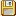
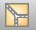

# Araç Çubuğu

  
 

| Icon  | Kısa Tanım   | Detaylı Bilgi   |
| :--- | :--- | :--- |
|  | **Yeni Proje**|Yeni proje başlatır.   |
||  **Proje Aç**| Bilgisayarınızdan mevcut bir projeyi yüklemek için Proje Aç diyaloğunu açar. |
||   **Proje Kaydet**|   Mevcut projeyi son haliyle kaydeder, yeni proje ise Kaydet diyaloğunu açar.   |
||   **İmzalı Kaydet**|   Mevcut projeyi imzalayarak kaydeder. |
||   **Yazdır**|   Aktif sayfayı yazcıya göndermek için Yazdır diyaloğunu açar. |
||   **DXF oluştur**|   Aktif sayfadaki plandan DXF dosyası oluşturur.   |
||   **Birleştir**|  Projeyi baskıda görünecek şekilde birleştirir |
||  **Malzeme Listesi**| Malzeme listesini getirir   |
||   **Kopyala**|   Mimari planı veya tesisatı kopyalar. |
||  **Yapıştır**|   Kopyalanmış mimari planı veya tesisatı ilgili yere yapıştırır. |
||   **Sil**|   Seçili elemanı siler. |
||   **Geri Al**|   Son hareketi geri alır. |
||   **Yinele**|   Geri alınan hareketi tekrar yapar. |
||   **Lokal Kayıplar**|   Lokal kayıplar formunu açar. |
||   **Boru Çapı Hesapları**|   Boru çapı hesapları formunu açar. |
||   **Baca Hesabı**|   Baca Hesabını açar |
||   **Otomatik Tasarla**|   Tesisat çaplarını optimum değerlere göre tasarlar. |
||   **Kontrol**|   Tüm projeyi teknik şartnameye göre kontrol eder. |
||  **Proje Kapağı**| Proje kapağını görüntüler   |
||   **İzometrik Şema**|   İzometrik şema formunu görüntüler. |
||   **Vaziyet Planı**|   Vaziyet planını görüntüler. |
||   **Katı Model**|   Mevcut kat planının 3 boyutlu görüntüsünü oluşturur. |
||   **Detay Büyüt**|   Detay penceresini büyütür /küçültür.|
||   **Cihaz Listesi**|   Hızlı nesne ekleme için hazır nesneler|