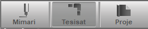

# Çalışma Modu

**Çalışma Modu**
  
   
  
Çalışma modu çubuğundaki seçeneklerle, proje üzerinde ne yapacağınızı belirlersiniz. Çalışam modunu belirlemek için çubukta yer alan ilgili butona tıklayınız.   
  

  
**Mimari Plan Modu**

Mimari plan üzerinde çalışmak için bu modda bulunmalısınız. Mimari plan modunda tesisata ait gösterimler silik gri ile çizilerek, mimari planda daha rahat çalışma sağlanır.   
  
Mimari plan modunda, oda veya duvar çizebilir, mevcut duvarları silebilir, pencere,kapı,kolon,merdiven gibi mimari plan elemanlarını ekleyip silebilir ve mimari elemanlar ile mahal ve birim özelliklerini tanımlayabilirsiniz.   
  
**Tesisat Planı Modu**

Tesisat planı üzerinde çalışmak için bu modda bulunmalısınız. Tesisat planı modunda mimariye ait gösterimler silik gri ile çizilerek, tesisat planında daha rahat çalışma sağlanır.   
  
Tesisat planı modunda, hat çizebilirsiniz, mevcut hatları ve tesisat elemanlarını silebilirsiniz, tesisata ait her şeyin özelliklerini tanımlayabilirsiniz.   
  
**Proje Modu**

Proje modu, çalışmadan ziyade görünüm amaçlıdır. Bu modda tesisat ve mimari planın baskı aşamasında birlikte nasıl görüneceğini izleyebilirsiniz.