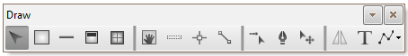
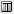
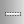
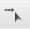
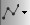

# Çizim Paneli

  

| Icon  | Kısa Tanım   | Detaylı Bilgi   |
| :--- | :--- | :--- |
|  | **Ok** |   Her hangi bir nesneyi seçmek, veya modifikasyon noktalarını kullanabilmek için kullanılır.   |
|  | **Oda** |   Mimari Planda oda çizmek için kullanılır.|
|  | **Duvar** |   Mimari planda duvar çizmek için kullanılır.|
|  | **Kapı** |   Mimari planda tıklanan duvara seri olarak kapı açmak için kullanılır.|
|  | **Pencere** |    Mimari planda tıklanan duvara seri olarak pencere açmak için kullanılır.|
|  | **Kaydır** |   Projenin kağıtta yerleşimini ayarlamak için kullanılır.   |
|  | **Kiriş** |   Mimari plana kiriş çizmek için kullanılır|
|  | **Refreans Noktası** |   Tüm katlarda kullanılabilecek bir dayama noktası oluşturmak için kullanılır.|
|  | **Referans Çizgisi** |  Tüm katlarda kullanılabilecek bir dayama çizgisi oluşturmak için kullanılır. |
|  | **Mouse ile Çiz** |   Mouse ile tesisat çizimini aktif eder|
|  | **Hat Çiz** |   Tesisat çizim moduna geçmek için kullanılır.|
|  | **Hat Noktası Taşı** |   Seçilen tesisat noktasını klavyeden seçilen ok yönlerinde kaydırır|
|  | **Aynalama** |   Mimari planda aynalama yapmak için kullanılır.|
|  | **Metin ekle** |   Mimari planda metin eklemek için kullanılır.|
|  | **Basit Şekiller** |   Mimari planda çizgi, dikdörtgen ve çember gibi basit şekiller çizmek için kullanılır.|