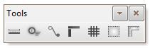
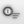
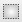

# Görünüm Paneli

 

| Icon  | Kısa Tanım   | Detaylı Bilgi   |
| :--- | :--- | :--- |
| |  **Mimari Ölçü**: | Mimari planda ölçüleri gösterip gizler|
| |  **Hat Etiketi**: | Hat etiketlerini gösterip gizler|
| |  **Bağlantı Çizgileri**: | Hat etiketleri ile hat arasında bağlantı çizgilerini gösterip gizler|
| |  **Cetvel**: | Cetveli gösterip gizler|
| |  **Izgara**: | Sayfada ızgaralı görünümü gösterip gizler|
| |  **Sayfa Sınırı**: | Sayfa sınırını gösterip gizler|
| |  **Birim Sınırı**: | Birim sınırını gösterip gizler|
