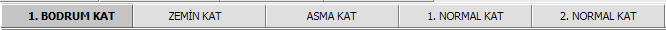
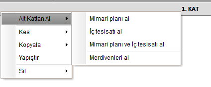
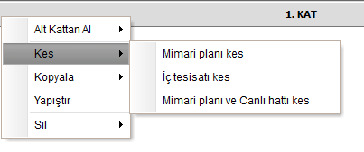
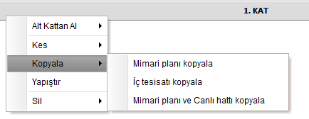
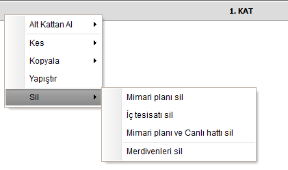

# Kat Geçiş Çubuğu

**Kat Geçiş Çubuğu**
  
   
  
Kat geçiş çubuğu üzerinde ilgili kata tıklayarak, o katın planına ve tesisat görünümüne geçebilirsiniz.

Ayrıca kat geçiş çubuğuna sap tıklayarak ilgili katların mimari ve tesisat planlarını kopyalama - yapıştırma - silme gibi işlemlerini ilgili kata gitmeden yapabilirsiniz. 

