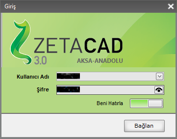
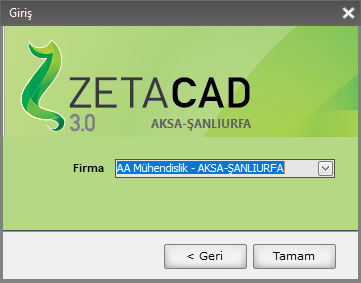

# Giriş Bilgileri

Zetacad programı ilk açıldığında kullanıcı bilgilerini soran bir giriş paneli karşılar. 

 

Kullanıcı; ***Kullanıcı adı*** ve ***şifre*** yazdıktan sonra, Dipos sistemi kullanıcının yetkili olduğu bölge (ya da bölgeleri) listeler. 

Kullanıcı buradan giriş yapmak istediği bölgeyi seçerek devam edebilir. 

Login olduktan sonra **Ayarlar / Firma Bilgileri** panelinden, Login olunan;

- **kullanıcı bilgileri** ,
- **firma bilgileri**  

detayları görünecektir. 

  

???+ note "Giriş Yapmadan Kullanım"
    Zetacad programını kullanmak için giriş yapma zorunluluğu yoktur.  Giriş sayfasını atlayarak doğrudan çizim ekranına ulaşabilirsiniz.   Giriş yapmayan kullanıcının dipos ile bir alış verişi olmayacaktır. Yani diposa proje kaydedemeyecek ve dipostan proje açamayacaktır.