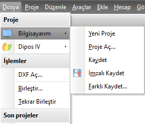
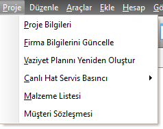
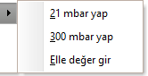
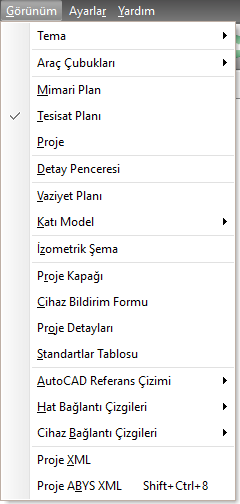

# Menüler

## Dosya Menüsü

???+ note "Bilgisayarım ile Dipos4 ögeleri farklı mı?"
    Bilgisayarım seçeneğinde, üzerinde çalışılan bilgisayardaki projeler söz konusudur. 
      Dipos4 seçeneğinde ise projeler doğrudan Diposa yani bulut sisteme kaydedilmekte ya da oradan açılmaktadır.

  
| <h4 style="color:#2E7D32;">Menu Ögesi  | <h4 style="color:#2E7D32;">Tanım   | 
|:---|:---|
| **Yeni Proje**        |Yeni proje başlatır.   |
| **Proje Aç**          |Bilgisayarınızdan ya da Diposta kayıtlı bir projeyi  yüklemek için _Proje Aç_ diyaloğunu açar. |
| **Kaydet**            |Mevcut projeyi son haliyle kaydeder,  yeni proje ise _Kaydet_ diyaloğunu açar.   |
| **İmzalı Kaydet**     |Mevcut projeyi imzalayarak kaydeder. |
| **Farklı Kaydet**     |Mevcut projeyi, yeni bir proje olarak farklı kaydeder |
| **DXF Aç**            |DXF dosyasını içe aktarmak için kullanılır  |
| **Birleştir**         |Projeyi baskıda görünecek şekilde birleştirir |
| **Tekrar Birleştir**  |Baskı önizlemesinde yapılan değişiklikleri  iptal ederek yeniden birleştirir |
| **Son Projeler**      |Son açılan projeleri listeler |
| **Çıkış**             |Programdan çıkmayı sağlar |
     

  
## Proje Menüsü  

| <h4 style="color:#2E7D32;">Menu Ögesi | <h4 style="color:#2E7D32;">Tanım   | 
|:---|:---|
| **Proje Bilgileri**                   | Proje bilgilerini girmek için ilgili formu açar.   |
| **Firma bilgilerini güncelle**        | Eski bir projede firma bilgileri eski ise,  yeni firma bilgilerini projeye iliştirir.   |
| **Vaziyet planını yeniden oluştur**   | Bina ve kat bilgilerini göz önüne alarak  otomatik vaziyet planı oluşturur.   |
| **Canlı Hat Servis Basıncı**          | Servis kutusu olmayan iç tesisat projelerinde   kutu basıncını belirlemek için kullanılır     **21 - 300 mbar seçilebilir.  Büyük kapasitei projeler için manuel girilebilir.**     |
| **Malzeme Listesi**                   | Projede kullanılan malzemelerin listesini verir.   |
| **Müşteri Sözleşmesi**                | Müşteri sözleşmesinin bilgileri  projedeki verilerle doldurulmuş olarak açılır.   Buradan çıktı alınarak müşteriye imzalatılabilir.   |

## Düzenle Menüsü  

| <h4 style="color:#2E7D32;">Menu Ögesi  | <h4 style="color:#2E7D32;">Tanım   | 
|:---|:---|
| **Kopyala**                                   | Mimari planı veya tesisatı kopyalar.   |
| **Yapıştır**                                  | Kopyalanmış mimari planı veya tesisatı ilgili yere yapıştırır.   |
| **Aynalayarak Yapıştır**                      | Tesisatı seçili noktadan aynalamak için  gerekli işlemi başlatır.   Bu menüyü tıkladıktan sonra   aynalamanın hedef noktası seçilmelidir.   |
| **Sil**                                       | Seçili elemanı siler.   |
| **Geri Al**                                   | Son hareketi geri alır.   |
| **Yinele**                                    | Geri alınan hareketi tekrar yapar.  |
| **Seçili Katın Mimari planını sil**           | Aktif kattaki mimari planı siler.   |
| **Seçili Katın Merdivenlerini sil**           | Aktif kattaki merdivenleri siler.   |
| **Tüm tesisatı sil**                          | Servis kutusu dahil tüm tesisatı siler.   |
| **Alt katın merdiven sistemini kopyala**      | Alt katta yer alan merdiven elemanlarını  üst kata kopyalar, üst katta varsa  eski merdiven elemanlarını siler.   |
| **Mimari planı sağa çevir**                   | Mimari planı verilen açıda sağa çevirir    |
| **Mimari planı sola çevir**                   | Mimari planı verilen açıda sola çevirir    |

## Araçlar Menüsü  

| <h4 style="color:#2E7D32;">Menu Ögesi  | <h4 style="color:#2E7D32;">Tanım   | 
|:---|:---|
| **Eskiz çalışması**                   | [Eskiz](eskiz-calismasi) çalışma formunu açar. |
| **Hesap makinesi**                    | Windows Standart Hesap Makinesini başlatır.   |
| **Projeyi ABYS de kontrol et**        | ABYS entegrasyonu olan bölgelerde   projenin ABYS ye uygun olup olmadığını denetler   |
| **Cihaz Marka Listesini Güncelle**    | Gazmer cihaz listesinin son güncel halini getirir   |

## Ekle Menüsü  

| <h4 style="color:#2E7D32;">Menu Ögesi  | <h4 style="color:#2E7D32;">Tanım   | 
|:---|:---|
| **Canlı Hat Başlat**            |İç tesisat projesinde, sayaç eklemek için  kolondan gelen temsili hattı ekler. |
| **Projeye Kutu Ekle**           |İç tesisat projesine sonradan  kolon eklemek için projeye kutu eklenebilir  |
| **Servis kutusunu  seçili hatta taşı** |projede kutuyu bağlı olduğu boru yerine  başka bir boruya bağlamak istediğimizde kullanılabilir. |
| **Kapı**                        |Seçili duvara kapı ekler veya seçili mahale kapı açar.   |
| **Pencere**                     |Seçili duvara pencere ekler veya seçili mahale pencere açar.   |
| **Menfez**                      |Seçili mahale atmosferi görecek şekilde menfez açar.   |
| **Kolon** |   |
| | **Duvara Kolon Ekle**    Seçili duvarın iki köşesine ya da tek köşesine kolon ekler.  Duvarın iki köşesi ya da tek köşesi farkı     [Varsayılan Değerler](varsayilan-degerler) panelinden seçilebilir   |
| | **Tüm Kolonları Oluştur**   Kattaki tüm duvarların köşelerine kolon ekler   |
| **Mimari Nesne** | |
| | **Alarm cihazı**    Seçili mahale alarm cihazı ekler.     |
| | **CO Alarm cihazı**    Seçili mahale karbonmonoksit alarm cihazı ekler.     |
| | **Çatı Menfezi**    Seçili mahalin çatıdan havalandırması   olduğunu belirten çatı menfezi ekler.     |
| | **Deprem Cihazı**    Seçili mahale deprem algılama cihazı ekler.     |
| | **Elektrik Şalteri**    Seçili mahale elektrik şalteri ekler.     |
| | **Yangın Tüpleri**    Seçili mahale yangın tüpleri ekler.     |
| **Merdiven**   ||
| |**Düz Merdiven**                 Seçili mahale düz merdiven ekler.   |
| |**Dönel Merdiven**               Seçili mahale dönel merdiven ekler.   |
| |**Sahanlık Zemini**              Seçili mahale ara sahanlık zemini ekler.   |
| |**Dönel - Yukarı Dayalı**        Seçili mahalin üst kısmına dayalı olarak dönel merdiven sistemi ekler.   |
| |**Dönel - Aşağı Dayalı**         Seçili mahalin alt kısmına dayalı olarak dönel merdiven sistemi ekler.   |
| |**Dönel - Sağa Dayalı**          Seçili mahalin sağ kısmına dayalı olarak dönel merdiven sistemi ekler.   |
| |**Dönel - Sola Dayalı**          Seçili mahalin sol kısmına dayalı olarak dönel merdiven sistemi ekler.   |
| |**Sahanlıklı - Yukarı Dayalı**   Seçili mahalin üst kısmına dayalı olarak düz merdiven sistemi ekler.   |
| |**Sahanlıklı - Aşağı Dayalı**    Seçili mahalin alt kısmına dayalı olarak düz merdiven sistemi ekler.   |
| |**Sahanlıklı - Sağa Dayalı**     Seçili mahalin sağ kısmına dayalı olarak düz merdiven sistemi ekler.   |
| |**Sahanlıklı - Sola Dayalı**     Seçili mahalin sol kısmına dayalı olarak düz merdiven sistemi ekler.   |
| **Vana**   ||
| |**Ana kesme vanası**            Seçili hat parçasına ana kesme vanası ekler.   |
| |**Tüketim vanası**              Seçili hat parçasına tüketim vanası ekler.   |
| |**Cihaz vanası**                Seçili hat parçasına cihaz vanası ekler.   |
| |**Emniyet vanası**              Seçili hat parçasına emniyet vanası ekler.   |
| |**Yan Bina Vanası**             Seçili hat parçasına yan bina tüketim vanası ekler.   |
| |**Domestik Tüketim vanası**     Seçili hat parçasına domestik tüketim vanası ekler.   |
| |**Selenoid Vana**               Seçili hat parçasına selenoid vana ekler.   |
| **Cihaz**   ||
| |**Kombi**                        Seçili hat parçasına kombi ekler.   |
| |**Ocak**                         Seçili hat parçasına ocak ekler.   |
| |**Soba**                         Seçili hat parçasına soba ekler.   |
| |**Şofben**                       Seçili hat parçasına şofben ekler.   |
| |**Kazan**                        Seçili hat parçasına kazan ekler.   |
| |**Büyük Kombi**                  Seçili hat parçasına büyük kombi ekler.   |
| |**Endüstriyel Cihaz**            Seçili hat parçasına endüstriyel cihaz ekler.   |
| |**Bacalı Endüstriyel Cihaz**     Seçili hat parçasına endüstriyel cihaz ekler.   |
| **İniş + Cihaz**   ||
| |**Kombi**                        Seçili hat parçasına iniş ve boru ucuna kombi ekler.   |
| |**Ocak**                         Seçili hat parçasına iniş ve boru ucuna ocak ekler.   |
| |**Soba**                         Seçili hat parçasına iniş ve boru ucuna soba ekler.   |
| |**Şofben**                       Seçili hat parçasına iniş ve boru ucuna şofben ekler.   |
| |**Kazan**                        Seçili hat parçasına iniş ve boru ucuna kazan ekler.   |
| |**Büyük Kombi**                  Seçili hat parçasına iniş ve boru ucuna büyük kombi ekler.   |
| |**Endüstriyel Cihaz**            Seçili hat parçasına iniş ve boru ucuna endüstriyel cihaz ekler.   |
| |**Bacalı Endüstriyel Cihaz**     Seçili hat parçasına iniş ve boru ucuna endüstriyel cihaz ekler.   |
| **Tüketim Ağzı**   ||
| |**Aşağıya tek ağız**            Seçili tesisat noktasından aşağıya  25 cm lik hat inerek ucuna tüketim vanası yerleştirir.   |
| |**Aşağıya iki ağız**            Seçili tesisat noktasından aşağıya  25 cm lik hat iner, sağa ve sola 25 cm hat ekleyerek  uçlarına tüketim vanası yerleştirir.   |
| |**Sola tek ağız**               Seçili tesisat noktasından sola doğru  25 cmlik hat ekler ve ucuna tüketim vanası yerleştirir.   |
| |**Sağa tek ağız**               Seçili tesisat noktasından sağa doğru  25 cmlik hat ekler ve ucuna tüketim vanası yerleştirir.   |
| |**Sağa-sola iki ağız**          Seçili tesisat noktasından sağa ve sola doğru  ayrı ayrı 25 cmlik iki hat ekler ve  uçlarına tüketim vanası yerleştirir.   |
| **Sayaç**                       |Seçili hat parçasına sayaç ekler.   |
| **İniş + Sayaç**                |Seçili hat parçasına iniş ve ucuna sayaç ekler.   |
| **Rotary Sayaç**                |Seçili hat parçasına rotary sayaç ekler.   |
| **Türbin Sayaç**                |Seçili hat parçasına türbin sayaç ekler.   |
| **Ultrasonik Sayaç**            |Seçili hat parçasına ultrasonik sayaç ekler.   |
| **Regülatör**                   |Seçili hat parçasına regülatör ekler.   |
| **Topraklama çubuğu**           |Seçili hat parçasına topraklama çubuğu ekler.   |
| **İzole Geçiş**                 |Seçili hat parçasına izole flanş ekler.   |
| **Filtre**                      |Seçili hat parçasına filtre ekler.   |
| **Diğer Tesisat  Nesneleri**     ||
| |**Kompansatör**                  Seçili hat parçasına Kompansatör ekler.   |
| |**Thermowell**                   Seçili hat parçasına Thermowell ekler.   |
| |**Manşon**                       Seçili hat parçasına Manşon ekler.   |
| |**Manometre**                    Seçili hat parçasına Manometre ekler.   |
| |**Korrektör**                    Seçili hat parçasına Korrektör ekler.   |
| |**Kit**                          Seçili hat parçasına Kit ekler.   |
| |**Termometre**                   Seçili hat parçasına Termometre ekler.   |
| |**PE-Çelik Geçiş**               Seçili hat parçasına PE-Çelik Geçiş ekler.   |
| **İniş-çıkış ekle**             |Seçili hat parçasından itibaren tesisatın arasına  iniş veya çıkış hattı ekler.   |

## Hesap Menüsü 

| <h4 style="color:#2E7D32;">Menu Ögesi  | <h4 style="color:#2E7D32;">Tanım   | 
|:---|:---|
| **Lokal kayıplar**        | Lokal kayıplar formunu açar.   |
| **Boru çapı hesapları**   | Boru çapı hesap formunu açar.   |
| **Baca Hesabı**           | Baca hesap formunu açar.   |
| **Baca Hesabı Şeması**    | Baca hesabındaki verilerin baca şeması üzerinde gösterildiği şemayı açar.   |
| **Havalandırma Hesabı**   | Havalandırma hesap formunu açar.   |
| **Linye Hattı Hesabı**    | Linye hattı hesap formunu açar.   |
| **Ölü hacim Hesabı**      | Ölü hacim hesap formunu açar.   |
| **300 mbar hesapları**    | 300 mbar hesap formunu açar.   |
| **Kontrol Raporu**        | Tüm projeyi şartname şartlarına göre kontrol eder.   |
| **Otomatik tasarla**      | Hat çaplarını optimum seviyede tasarlar.   |
| **Tesisatı Analiz Et**    | Hat çaplarını optimum seviyede tasarlar.   |
| **Kritik hat analizi**    | Kritik hatları analiz etmek için, kritik hat formunu açar.   |

## Görünüm Menüsü  

| <h4 style="color:#2E7D32;">Menu Ögesi  | <h4 style="color:#2E7D32;">Tanım   | 
|:---|:---|
| **Mimari plan**       | Çalışma modunu mimari plana geçirir.   |
| **Tesisat planı**     | Çalışma modunu tesisat planına geçirir.   |
| **Proje**             | Çalışma modunu proje moduna geçirir.   |
| **Detay penceresi**   | Detay pencresini gösterir.   |
| **Vaziyet planı**     | Vaziyet planını açar.   |
| **Katı Model**        | |
| **Mevcut Kat**        | Aktif katın 3 boyutlu görüntüsünü oluşturur.   |
| **Tüm bina**          | Tüm binanın 3 bıyutlu görüntüsünü oluşturur.   |
| **İzometrik Şema**    | İzometrik şema görüntüleme formunu açar.   |
| **Proje kapağı**      | Proje kapağını görüntüler.   |

## Ayarlar Menüsü

| <h4 style="color:#2E7D32;">Menu Ögesi  | <h4 style="color:#2E7D32;">Tanım   | 
|:---|:---|
| **Firma bilgileri**   | Firma bilgileri formunu açar.   |
| **Katlar**            | Kat ayar panelini açar.   |
| **Kağıt Ayarları**    | Kağıt ayar panelini açar.   |
| **Seçenekler**        | Seçenekler panelini açar.   |

## Yardım Menüsü  

| <h4 style="color:#2E7D32;">Menu Ögesi  | <h4 style="color:#2E7D32;">Tanım   | 
|:---|:---|
| **Yardım dosyası**        | Bu yardım dosyasını açar.   |
| **Zetacad web sitesi**    | www.zetacad.com sitesini explorer da açar.   |
| **Hakkında**              | Programın hakkında penceresini açar.|