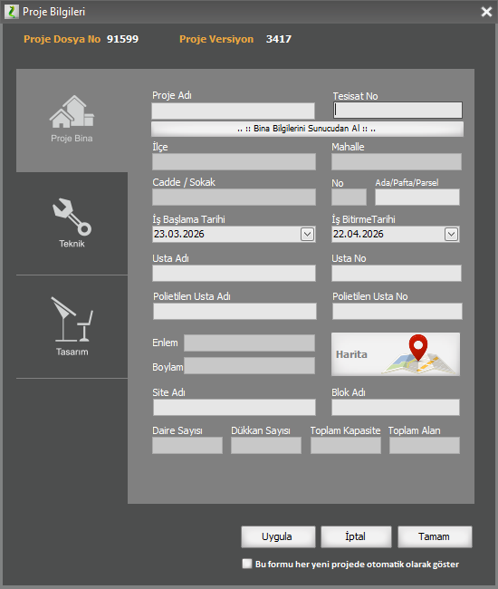
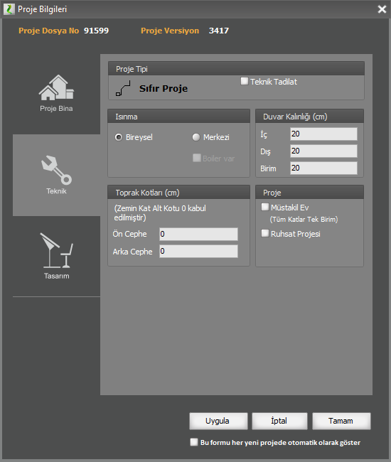
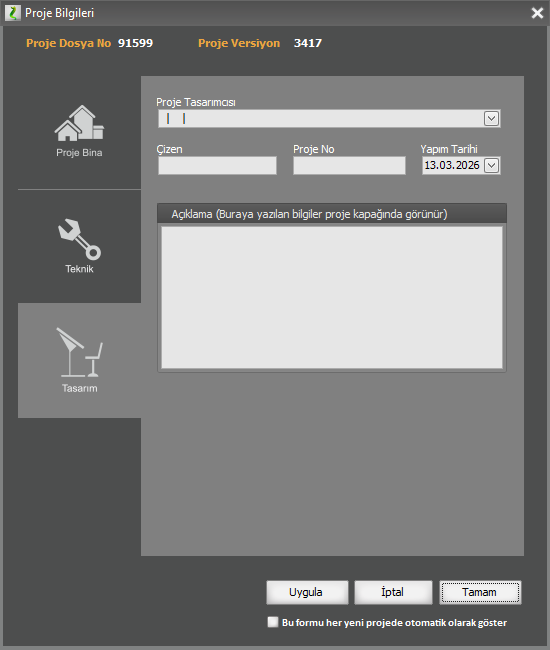

# Proje Bilgileri

**Proje Bilgileri**

Proje Bilgileri penceresi 4 ayrı açılır/kapanır panelden oluşmaktadır. Bu pencereye Poje menüsünden ulaşabilirsiniz.   
  
**Proje Paneli**   

Bu panelde proje adını, regülatör ve servis hattı kayıt numarasını belirleyebilirsiniz.   

Bu panelde bina adres bilgilerini girebilirsiniz. Ayrıca eğer bina müstakil bir bina ise, yani bütün mimari planlar tek bir bağımsiz birim ise, _Müstakil Bina_ kutucuğunu işaretleyiniz. Bu durumda tesisatınız bağımsız birim analizleri ve hat mahal kontrolleri buna göre yapılacaktır.    

   
  
  
  

**Teknik Paneli**

Bu panelde proje ile ilgili teknik bilgileri girebilirsiniz. Proje tipinde, projenin sıfır proje, veya sadece iç tesisat olup olmadığını belirtiniz. Eğer proje bunlardan birinin teknik tadilatı ise teknik tadilat seçeneğini seçiniz. Proje Tipi, iç tesisat ise, kapakta yer alan bazı bilgiler (toplam kapasite,toplam alan,daire ve işyeri sayısı) otomatik olarak hesaplanamaz. Bu durumda ataç işaretine basarak açılan ek bilgiler panelinden, bu değerleri sağlayabilirsiniz.   
Isınma tipi bu versiyonda sadece bireysel olabilir. Merkezi sistem projeleri bir sonraki sürümde aktive edilecektir.   
Duvar kalınlığı değeri varsayılan olarak 20 cmdir. Bu değeri değiştirerek daha kalın veya ince duvarlara sahip mimari planlar çizebilirsiniz. Duvar kalınlığı değeri, binanın tüm duvarlarına uygulanır.   
Toprak kotlarına girdiğiniz ön ve arka cephe kotları vaziyet planında kullanılmakla beraber, toprak altında kalarak atmosfere bakmayan cepheler ortaya çıkmış olacaktır. Cephe kotlarını girerken zemin katın zemini 0 kabul ederek giriniz. Örneği arka cephe toprak seviyesi zemin katın tavanına denk geliyorsa, 300 değeri girilmelidir.   

**Tasarım Paneli**

Bu panelde proje tasarımcı mühendisi seçebilir, proje yapım tarihini girebilirsiniz. Ayrıca proje kapağında gözükecek bir açıklamayı buadan belirleyebilirsiniz. Proje No için ayrılan yer, firmanız içinde projelenize verdiğiniz arşiv numarası içindir. Buraya girilen no aynı zamanda kapakta da yer alır. 

   
  
