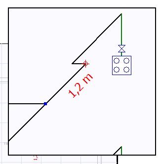
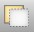

# Detay Penceresi
  
   

Detay penceresi çizim ekranının sağ üst köşesinde isteğe bağlı olarak açılır. 

!!! tip "Detay Penceresini açmak için"
      
     
    *  **butonu** 
    * **CTRL + Q** 
    * **F2** 
    * **Görünüm/Detay Penceresi**
      seçeneklerinden biri kullanılabilir

  

Bu pencere ilk açıldığında sağ üst köşede 300x300 boyutlarındadır, pencereyi tüm çizim alanına yaymak için araç çubuğundaki detay düyüt  butonunu kullanabilirsiniz. 

Detay penceresinin sol alt köşesinden tutarak boyutlandırabilir ve tam sayfa olana kadar büyütebilirsiniz. 

Mimari plan çalışma modunda , bu pencerede kat planının belirli kısmı daha büyük olarak gösterilir, tesisat planı çalışma modunda ise tesisat planının izometrik görünümü yer alır. Detay penceresini üstten görünüş planında seçili olan bir noktaya merkezlemek için **Ctrl+E** klavye kısayolunu kullanın.

  
**Normal çizim ekranında aktif olan tüm komutlar bu pencerede de aktiftir.**   
  
