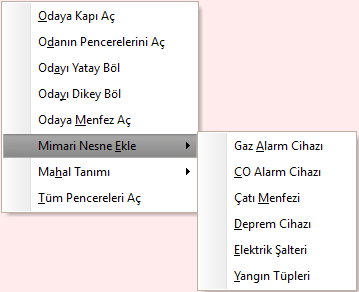
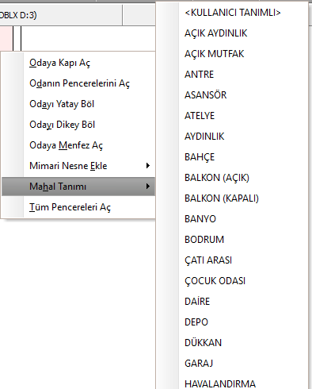
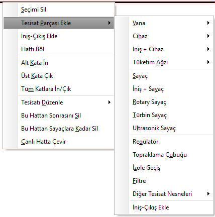
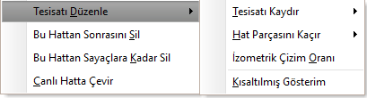
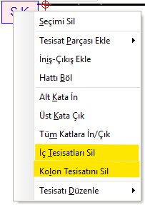
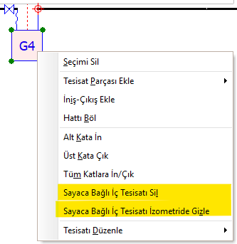

# Sağ Tuş Menüsü

 
Zetacad tasarım ortamında herhangi bir nesneye veya konuma farenizin sağ tuşu ile basığınızda bir çok Windows uyumlu programda olduğu gibi bir sağ tuş menüsü açılacaktır. Bu menüye PopUp menü veya İçerik Menüsü ismi de verilir.   
  
Zetacad içerik menüsü açılırken, seçili olan nesneyi dikkate alarak içeriğini düzenler.   

### Mahal sağ tık menüsü:

|<h4 style="color:#2E7D32;">Menü Ögesi|<h4 style="color:#2E7D32;">Tanım|
|:---|:---|
|**Odaya Kapı Aç** |Diğer mahallerden seçili mahale kapılar açar.   Odalardan koridora kapıları açmak için kullanılır|
|**Odanın Pencerelerini Aç** |Seçili mahalin atmosfere bakan duvarlarına pencere nesnesi yerleştirir|
|**Odayı Yatay Böl** | Seçili mahalin ortasına yatay duvar yerleştirir.   |
|**Odayı Dikey Böl** | Seçili mahalin ortasına dikey duvar yerleştirir.   |
|**Odaya Menfez Aç** | Seçili mahalin atmosfere bakan duvarına menfez açar.   |
|**Mimari Nesne Ekle**||
||**Gaz Alarm cihazı**  Seçili mahale gaz alarm cihazı ekler.|
||**CO Alarm cihazı**  Seçili mahale karbonmonoksit alarm cihazı ekler.|
||**Çatı Menfezi**  Seçili mahalin çatıdan havalandırması  olduğunu belirten çatı menfezi ekler.|
||**Deprem Cihazı**  Seçili mahale deprem algılama cihazı ekler.|
||**Elektrik Şalteri**  Seçili mahale elektrik şalteri ekler.|
||**Yangın Tüpleri**  Seçili mahale yangın tüpleri ekler.|
|**Mahal Tanımı** | Mahal listesi açılır. Listeden bir mahal adı seçilir.     |
|**Tüm Pencereleri Aç**|Mimari planın tüm atmosferik duvarlarına pencere yerleştirir.  |
  

!!! tip "Serbest Mahal Adı Tanımlama" 
    Boru, cihaz gibi herhangi bir tesisat elemanı olmayan mahale serbest mahal adı verilebilir. 

  
   

### Duvar sağ tık menüsü:

|<h4 style="color:#2E7D32;">Menü Ögesi|<h4 style="color:#2E7D32;">Tanım|
|:---|:---|
|**Seçimi Sil** |Seçili olan nesneyi siler.   |
|**Duvara Kapı Ekle**   |Seçili duvara kapı yerleştirir.|   
|**Duvara Pencere Ekle**  | Seçili duvara pencere yerleştirir.  | 
|**Duvara Kolon Ekle**   |[Varsayılan Değerler ](../ayarlar/varsayilan-degerler.md) panelinde yapılan seçime göre  Seçili duvarın tek ya da iki köşesine kolon yerleştirir.|  
|**Duvara Menfez Ekle**   | Seçili duvara menfez yerleştirir.   |
|**Duvara Baca Ekle**   | Seçili duvara baca yerleştirir.   |
|**Duvarı Böl**   |Seçili duvarı ortadan ikiye ayırır   |
|**Tüm Pencereleri Aç**|Mimari planın tüm atmosferik duvarlarına pencere yerleştirir.  |
 
   

### Tesisat sağ tık menüsü:

   
  

|<h4 style="color:#2E7D32;">Menü Ögesi|<h4 style="color:#2E7D32;">Tanım|
|:---|:---|
|**Seçimi Sil** |Seçili olan nesneyi siler.   |
|**Tesisat Parçası Ekle**  | Seçili hattın ucuna vana,cihaz vb. tesisat parçalarını ekler.   Ayrıntılı bilgi [Ekle menüsü altında](../menuler/ekle.md)  gösterilmiştir.     
|**İniş-çıkış ekle**|Seçili hat parçasından itibaren tesisatın arasına iniş veya çıkış hattı ekler.|
|**Hattı Böl**  |Seçili hattı iki eşit boru parçasına böler (Ctr+T) |
|**Alt kata in**  |Kat yüksekliğine göre bir alt kata tesisat çizer |
|**Üst kata çık**  |Kat yüksekliğine göre bir üst kata tesisat çizer |
|**Tüm katlara in çık**  |Bulunulan noktadan itibaren  altta ve üstte ne kadar kat varsa  tüm katlara tesisat çizer |
|**Tesisatı Düzenle**  |Bu menü altında 4 seçenek vardır.    |  
||**Tesisatı Kaydır**   Seçili noktadan itibaren  tesisatı verilen miktar kadar  sağa,sola,ileri veya geri kaydırır.   |
||**Hat parçasını kaçır**   Birbirini örten hat parçalarını gösterebilmek için,  seçili olan hat parçasını kaçık çizer.   |
||**İzometrik çizim oranı**     Seçili hattın izometrik şemada  olduğundan daha kısa veya uzun çizilmesini sağlar.   |
||**Kısaltılmış Gösterim**     Çok uzun hatları çizim aşamasında   kısaltılmış olarak göstermek için kullanılır. |
|**Bu hattan sonrasını sil**  |Seçilen hatta bağlı olan tüm tesisatları siler. |
|**Bu hattan sayaçlara kadar sil**  |Seçilen hattan itibaren   sayaçlara kadar olan tüm kolonları siler|
|**Canlı Hatta Çevir**  |Kolon tesisatını iç tesisattan koparmak için  sayaç önünde bu komut verildiğinde  sayacı canlı hat olarak başlatmış gibi  kolondan ayıracaktır.  |

   

### Servis Kutusu sağ tık menüsü:

   
  

|<h4 style="color:#2E7D32;">Menü Ögesi|<h4 style="color:#2E7D32;">Tanım|
|:---|:---|
|**İç tesisatları Sil** |Tüm iç tesisatları siler ve kolonu yalnız bırakır.   Sadece kolon tadilat projeleri için kullanılabilir.|
|**Kolon tesisatını Sil** |Servis kutusu dahil tüm kolon tesisatları silinecek ve   iç tesisatların tamamı canlı hatta çevrilecektir.|

   

### Sayaç sağ tık menüsü:

   
  
|<h4 style="color:#2E7D32;">Menü Ögesi|<h4 style="color:#2E7D32;">Tanım|
|:---|:---|
|**Sayaca Bağlı İç Tesisatı Sil** |sayaç ve kendisine bağlı tüm iç tesisat silinecektir|
|**Sayaca Bağlı İç Tesisatı İzometride Gizle** |Bazı iç tesisatlar birbirinin aynı olduğu için   izometride bunların hepsini gösterip karışık   bir görüntü sunmak yerine, bunlardan yalnızca  birini gösterip diğerlerini gizleyebiliriz.   Gizlenmiş olan bir iç tesisatı göstermek istersek   yine sayaca sağ tıklayıp "**Sayaca Bağlı İç Tesisatı   İzometride Göster**" dememiz gerekir.|
