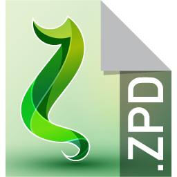

# Versiyon Bilgileri

Zetacad doğalgaz projeleri için özelleştirilmiş bir programdır. 

Zetacad; proje mühendisleri, onay mühendisler, ön kontrol personelleri, öğrenciler gibi farklı disiplinler tarafından farklı amaçlarla kullanılmaktadır. Zetacad programı farklı amaçlara yönelik farklı alt versiyonlara ayrılmıştır. 

Bunlar özetle şu şekildedir. 

## Zetacad Studio:

Firmaların ticari olarak sahip olduğu, proje çizim için kullandıkları versiyondur. Her gaz dağıtım için özelleştirilmiş kuralları işletir. Bu versiyonda çizilen projeler dijital imza ile imzalanarak Dipos'a gönderilebilir. 

Üretilen projelerin uzantısı ._zpd_ (zetacad proje dosyası) dir.

**Zetacad studio ikonu:**

{width="100"}

**Zetacad proje ikonu:** 

{width="100"}

!!! info "Bu dokuman zetacad studio için hazırlamıştır."
    Bu dokuman zetacad çizim özelliklerini kullanıcıya aktarmak amacıyla hazırlanmıştır. Dokuman içerisinde zetacad olarak anılan sürüm zetacad studio sürümüdür. Diğer sürümlere atfen bir metin geçecek olursa özellikle sürüm ismi vurgulanacaktır.

## Zetacad Onay:

Bu program onay mühendislerinin proje inceleme ve onaylama amacıyla kullandıkları sürümdür. Programa kullanıcı adı ve şifreyle bağlanılarak onay bekleyen projeler listelenir. İncelenen proje reddedilebilir ya da onay mühendisinin dijital imzasıyla imzalanabilir. Proje imzalandığında proje PDF dosyasına imza kaydedilir. 

Bu sürümde proje üzerinde kalıcı değişiklik yapılamaz. Yalnızca geçici olarak izometride değişiklik yapılabilir ve bu kalıcı değildir. Zetacad studio programına arayüz olarak benzemekle birlikte işlev açısından tamamen farklıdır. Ürün, çizim yerine çizilmiş projeyi incelemeye odaklanmıştır.

İkonu zetacad studio ile aynıdır. Tek farkı, kısayol oluşturulduğunda metin olarak studio yerine onay yazmaktadır.

## Zetacad Viewer:

Bu program kullanıcı adı ve şifre olmadan çalıştırılabilir. Zetacad projelerinin görüntülenmesi amacıyla kullanılmaktadır. Proje onay programına benzer ancak onay red işlemleri yapılamaz. 

## Zetacad Free:

Bu sürüm eğitim amacıyla kullanılmaktadır. Proje uzantısı .zpt olarak ticari sürümden farklıdır ve zpt uzantısıyla çizilen projeler Diposa gönderilemezler. 

Bu programda güvenlik gerekçesiyle DXF dönüşümü kapatılmış ve eklenebilecek kat sayısı 4 le sınırlandırılmıştır. Bunlar dışındaki tüm program özellikleri birebirdir.  

## Zetacad Web Modülü:

Programın amacı, çizilen projelerin gaz dağıtım şirketine gönderilmesini sağlamak, evrak ve poliçe bekleyen projeleri görebilmek, projelerin onay red durumlarını takip etmek ve projeler için arşiv sağlamaktı. Bütün bu süreçler Zetacad 4.0 ile birlikte Diposa taşınmış ve prgram bağımlılığı kaldırılmıştır.

_~~Bu program Zetacad 4.0 ile birlikte tedavülden kaldırılmıştır~~._

