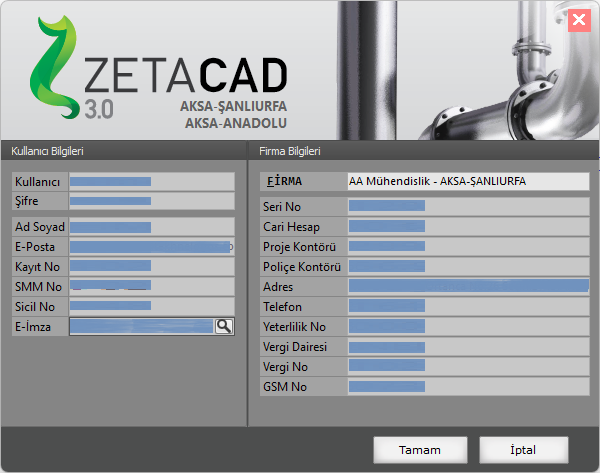

# Firma Bilgileri

**Firma Bilgileri****  
** |      
---|---  
  
_Firma Bilgileri formuna ayarlar menüsünden ulaşabilirsiniz. Bu formda firmanıza ait bilgileri bir kereye mahsus olmak üzere giriniz. Böylelikle proje kapaklarında firma bilgileriniz otomaik olarak yer alacaktır.  
_   
**Firma Bilgileri :** Firmanızın isim,adres,telefon,yetki no ve vergi bilgilerini buradan giriniz.   
  
**Yetkili Mühendiler :** Firmanızda proje telif eden mühendileri bu tabloya giriniz. Girilmiş bir mühendisi silmek için DEL tuşuna basınız, yeni mühendis eklemek için tablo üzerindeyken sağ fare tuşuna basarak açılan menüyü kullanınız.   
  
**Firma Logosu :** Firmanızın logosunu buraya yüklediğiniz durumda proje kapağında isim yerine logo yer alır. Ancak projenizin oluştrulan dxf kopyesinde logonuz yer almaz.   
  
**Firma bilgilerinde yapılan değişiklikleri**** _Kaydet_****butınu ile kaydediniz.**   
|     
  
---|---