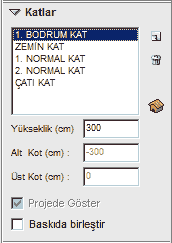
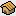

# Katlar

**Katlar**
  
  
   
  

Projenizde yer alan katları buradan ekleyebilirsiniz. Eklediğiniz katın özellklerini aynı şekilde bu panelden takip edebilirsiniz. Katlar paneline, ekranın sağında yer alan özellikler panelinin alt kısmından veya ayarlar menüsünden ulaşabilirsiniz.  
 
**Kat Ekle :** 
Kat eklemek için bu butona bastığınızda açılan menüyü kullanın.   

**Kat Sil :**
Kat silmek için bu butona basınız. Sildiğiniz katın içinde yer alan mimari projede silinecektir. Kattan geçen tesisat, tesisat bütünlüğünü korumak için silinmez.   

**Kat Vaziyeti** : Bu butona bastığınızda tüm katların zemin ve tavan kotlarını görebileceğiniz bir gösterim açılır.   
  
**Yükseklik** : Kat yüksekliğini cm cinsinden buraya girebilirsiniz.
  
**Alt Kot** : Kat zeminin binada hangi kota denk geldiğini buradan görebilirsiniz.   

**Üst Kot** : Kat tavanının binada hangi kota denk geldiğini buradan görebilirsiniz.   
  
**Baskıda birleştir :** Eğer belirli katlarda yer alan her şey aynı ise o katları baskı aşamasında tek bir çizimde birleştirebilirsiniz. Baskıda birleştir seçeneği seçili ise, kat alt katla beraber çizilir.   

