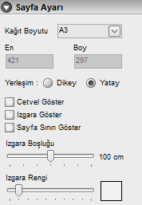

# Sayfa Ayarı

  

Kat planlarının çalışma alanının boyutunu buradan belirleyebilirisiniz. Buradan girilen sayfa ayarı sadece çalışma alanınızın boyutlarını belirler.  

**Kağıt boyutu :** Buradan standart bir boyut seçebilirsiniz. Eğer standart dışı bir sayfa ölçüsü kullanacaksanız , bu kısımdan _özel_ seçeneğini seçiniz. Çıktı alınmayacaksa bu boyutun bir önemi yoktur. Zetacad sonsuz genişliğe yayılır. 

**En :** Sayfa enini cm cinsinden burada görebilirsiniz . Eğer sayfa boyutu özel ise bu değeri değiştirebilirsiniz.  

**Boy :** Sayfa boyunu cm cinsinden burada görebilirsiniz . Eğer sayfa boyutu özel ise bu değeri değiştirebilirsiniz.  

**Yerleşim :** Sayfa yerleşiminin dikey yada yatay olduğunu burada belirtiniz.   

**Cetvel Göster :** Bu seçenek çalışma alanında gerçek ölçüleri gösteren yatay ve dikey cetveller oluşturur.   

**Izgara Göster :** Bu seçenek çalışma alanında gridler gösterir. Bu ızgaraların yoğunluğunu yine aynı paneldeki **ızgara boşluğu** ve **ızgara rengi** seçenekleriyle ayarlayabilirsiniz.

**Sayfa sınırı göster:** Bu seçenek çalışma alanında seçilen sayfanın sınırlarını gösterir. Bunun görünmesi algısal olarak projenin büyüklüğü hakkında fikir verebilir. 

   
  