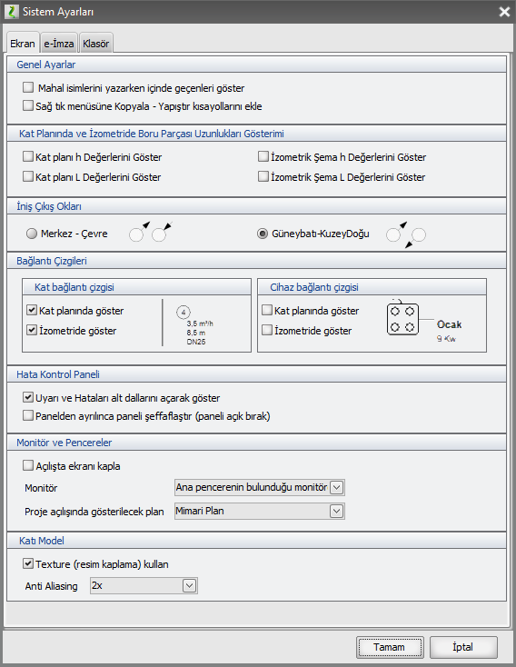
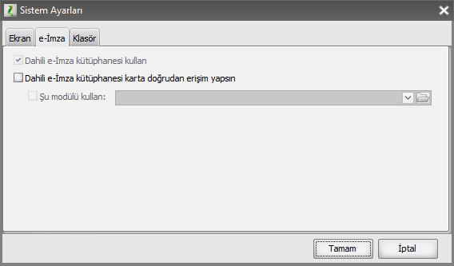
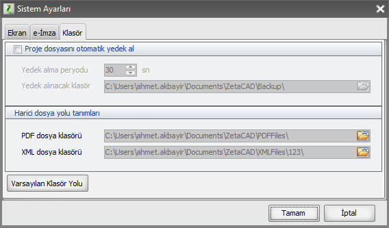

# Sistem Ayarları

  
   
  
Bu alanda pek çok kalıcı ayar yapabilirsiniz. 

**Mahal İsimlerini yazarken içinde geçenleri göster:** Bir mahali seçip klavyeden harflere bastığınızda doğrudan arama yapar. 

Örneğin _AN_ yazdığınızda **AN**TRE ve B**AN**YO mahallerinin bulunmasını mı yoksa sadece AN ile başlayan mahalleri mi (**AN**TRE) getirmek istersiniz. 

bu seçenek işaretli olursa her iki mahali de bulacaktır. işaretli değilse sadece ANTRE gibi kelimenin başında arayacaktır.

**Buna benzer Çok sayıda ayar bu sayfada yapılmaktadır**

---

Sağ tık menüsünde **kopyala - yapıştır** seçeneklerini gösterip gizleyebilirsiniz.

---

kat planı ve izometride, **yükseklik ve uzunluk**ları gösteren değerleri açıp gizleyebilirsiniz. 

---

**iniş çıkış oklarının yönü**nü ayarlayabilirsiniz.

---

hat ile etiketi arasında, cihaz ile etiketi arasında **bir bağlantı çizgisi**ni her zaman göstermek ya da gizlemek isteyebilirsiniz.

---

**Hata kontrol paneli** Uyarı ve hatalarını sadece başlık seviyesinde ya da detaylı görüntülemeyi seçebilirsiniz.

---

Projeyi her zaman **mimari ya da tesisat** modunda başlatmak isteyebilirsiniz.

---

**katı model** performansı için anti aliasing seçeneklerini değiştirebilirsiniz.

---

**e imza** sekmesinden imza ayarlarını yapabilirsiniz.

   
  
---

**Klasör** sekmesinden 
- projenin yedek alıp almaması, 
- ne kadar bir zamanda yedek alacağı, 
- hangi klasöre yedekleyeceği, 
- İmzalı proje PDF'i ya da Gazmer cihaz listelerinin hangi klasörde depolanacağını

 seçebilirsiniz.

 
   
  