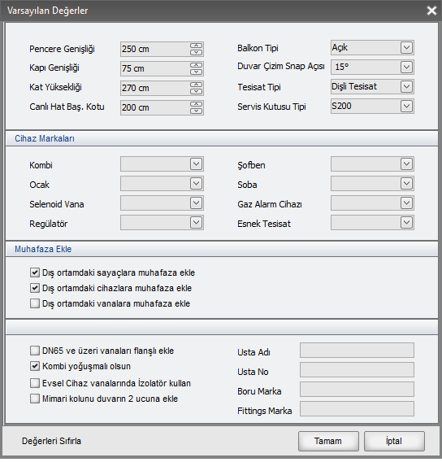

# Varsayılan Değerler

  

Projede sürekli yaptığınız seçimleri bir defa bu ekrandan girdiğinizde sonraki projeler için hep aynı bilgileri tekrar tekrar girmekle uğraşmayacaksınız. 

- Kapı - Pencere Genişliği, Kat yüksekliği, Balkonun açık mı kapalı mı olmasını istediğiniz gibi verileri seçebilirsiniz
 

- Duvar çizerken mouse hangi açılara kilitlensin. 90° yaparsanız sadece dik duvarlar, 45° yaparsanız çapraz duvarlar çizebilirsiniz. 15-30-60 gibi ara değerler de verilirsiniz. 0° yaparsanız istediğiniz yönde serbest çizime kavuşursunuz.
 
- servis kutusunun hangi tip eklenmesi gerektiğini, canlı hat başlatırken sayacın yüksekliğini, iç tesisatın dişli mi kaynaklı mı yoksa esnek mi gelmesi gerektiğini söyleyebilirsiniz.
 
- Kombi, ocak, soba, sofben ya da tesisat elemanlarının markalarını belirleyebilirisniz. 
 
- dış ortama eklenen nesnelere otomatik muhafaza tanımlayabilirsiniz.
 

...

 

bu şekilde resimde görünen tüm seçenekleri verebilirsiniz. 
 

!!! info "Varsayılan Değerler Projede İsterseniz Değiştirilebilir"
    Varsayılan değerler panelinden yaptığınız seçimler, projede başka bir seçim yapamayacağınız anlamına gelmez. Buradaki seçimleri isterseniz projede değiştirebilirsiniz. Örneğin Varsayılan tesisat Tipi Esnek olsun dediğinizde, projeye bir sayaç eklediğinizde esnek tesisat işaretli gelir. isterseniz projede esnek tesisat işaretini kaldırıp dişli ya da kaynaklı seçebilirsiniz. Varsayılan değerler paneli sürekli seçim yaptığınız konularda seçimlerinizi azaltarak işlerinizi hızlandırma amaçlıdır. 

   
  