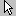
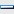
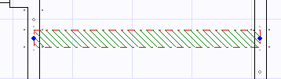
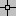
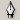
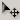
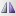

# Çizim Paneli

**Çizim Paneli**
  
Çizim Panelinde yer alan araçlar sırasıyla şunlardır.   
  
   
|  **_Ok_**   
|  Her hangi bir nesneyi seçmek, veya modifikasyon noktalarını kullanabilmek için kullanılır.   
  
---|---|---  
   
|  **_Oda_**   
|  Mimari Planda oda çizmek için kullanılır.   
  
   
|  **_Duvar_**   
|  Mimari planda duvar çizmek için kullanılır.   
  
   
|  **_Kaydır_**   
|  Projenin kağıtta yerleşimini ayarlamak için kullanılır.   
  
   
|  **_Kiriş_**   
|  Mimari plana kiriş çizmek için kullanılır   
  
   
|  **_Refreans Noktası_**   
|  Tüm katlarda kullanılabilecek bir dayama noktası oluşturmak için kullanılır.   
  
   
|  **_Referans Çizgisi_**   
|  Tüm katlarda kullanılabilecek bir dayama çizgisi oluşturmak için kullanılır.   
  
   
|  **_Hat Çiz_**   
|  Tesisat çizim moduna geçmek için kullanılır.   
  
   
|  **_Hat Taşı_**   
|  Tesisat nokta taşıma moduna geçmek için kullanılır.   
  
   
|  **_Aynalama_**   
|  Mimari planda aynalama yapmaka için kullanılır.   
  
.   
  
**__**   
**__**   
**__**   
**__**