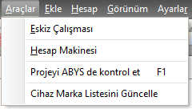

## Araçlar Menüsü  

|<h4 style="color:#2E7D32;">Menu Ögesi|<h4 style="color:#2E7D32;">Tanım|
|:---|:---|
|**Eskiz çalışması**|[Eskiz](eskiz-calismasi) çalışma formunu açar.|
|**Hesap makinesi**|Windows Standart Hesap Makinesini başlatır.|
|**Projeyi ABYS de kontrol et**|ABYS entegrasyonu olan bölgelerde  projenin ABYS ye uygun olup olmadığını denetler|
|**Cihaz Marka Listesini Güncelle**|Gazmer cihaz listesinin son güncel halini getirir|
