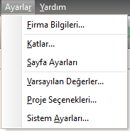

## Ayarlar Menüsü

|<h4 style="color:#2E7D32;">Menü Ögesi|<h4 style="color:#2E7D32;">Tanım|
|:---|:---|
|**Firma bilgileri**|[Firma bilgileri](../ayarlar/firma-bilgileri.md) formunu açar.|
|**Katlar**|[Katlar](../ayarlar/katlar.md) panelini açar.|
|**Sayfa Ayarları**|[Sayfa Ayarları](../ayarlar/sayfa-ayari.md) panelini açar.|
|**Varsayılan Değerler**|[Varsayılan Değerler](../ayarlar/varsayilan-degerler.md) panelini açar.|
|**Proje Seçenekleri**|[Proje Seçenekleri](../ayarlar/proje-secenekleri.md) panelini açar.|
|**Sistem Ayarları**|[Sistem Ayarları](../ayarlar/sistem-ayarlari.md) panelini açar.|
