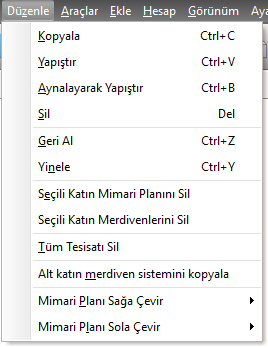
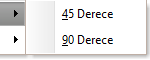

## Düzenle Menüsü  

|<h4 style="color:#2E7D32;">Menu Ögesi|<h4 style="color:#2E7D32;">Tanım|
|:---|:---|
|**Kopyala**|Mimari planı veya tesisatı kopyalar.|
|**Yapıştır**|Kopyalanmış mimari planı veya tesisatı ilgili yere yapıştırır.|
|**Aynalayarak Yapıştır**|Tesisatı seçili noktadan aynalamak için gerekli işlemi başlatır.  Bu menüyü tıkladıktan sonra  aynalamanın hedef noktası seçilmelidir.|
|**Sil**|Seçili elemanı siler.|
|**Geri Al**|Son hareketi geri alır.|
|**Yinele**|Geri alınan hareketi tekrar yapar.|
|**Seçili Katın Mimari planını sil**|Aktif kattaki mimari planı siler.|
|**Seçili Katın Merdivenlerini sil**|Aktif kattaki merdivenleri siler.|
|**Tüm tesisatı sil**|Servis kutusu dahil tüm tesisatı siler.|
|**Alt katın merdiven sistemini kopyala**|Alt katta yer alan merdiven elemanlarını üst kata kopyalar, üst katta varsa eski merdiven elemanlarını siler.|
|**Mimari planı sağa çevir**|Mimari planı verilen açıda sağa çevirir |
|**Mimari planı sola çevir**|Mimari planı verilen açıda sola çevirir |

