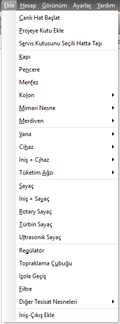
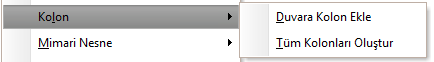
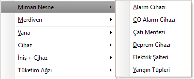
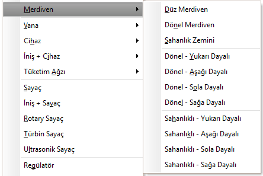
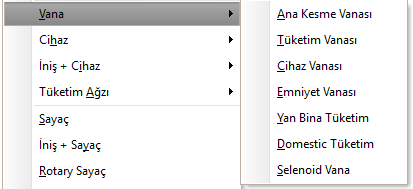
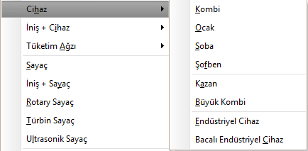
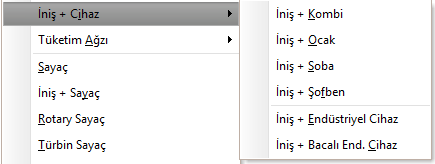
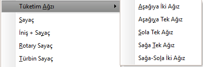
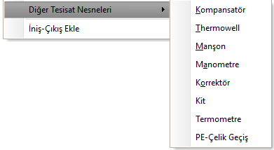

## Ekle Menüsü  

|<h4 style="color:#2E7D32;">Menü Ögesi|<h4 style="color:#2E7D32;">Tanım|
|:---|:---|
|**Canlı Hat Başlat**|İç tesisat projesinde, sayaç eklemek için kolondan gelen temsili hattı ekler.|
|**Projeye Kutu Ekle**|İç tesisat projesine sonradan kolon eklemek için projeye kutu eklenebilir|
|**Servis kutusunu seçili hatta taşı**|projede kutuyu bağlı olduğu boru yerine başka bir boruya bağlamak istediğimizde kullanılabilir.|
|**Kapı**|Seçili duvara kapı ekler veya seçili mahale kapı açar.|
|**Pencere**|Seçili duvara pencere ekler veya seçili mahale pencere açar.|
|**Menfez**|Seçili mahale atmosferi görecek şekilde menfez açar.|
|**Kolon**||
||**Duvara Kolon Ekle**  Seçili duvarın iki köşesine ya da tek köşesine kolon ekler. Duvarın iki köşesi ya da tek köşesi farkı  [Varsayılan Değerler](varsayilan-degerler) panelinden seçilebilir|
||**Tüm Kolonları Oluştur**  Kattaki tüm duvarların köşelerine kolon ekler|
|**Mimari Nesne**||
||**Alarm cihazı**  Seçili mahale alarm cihazı ekler.|
||**CO Alarm cihazı**  Seçili mahale karbonmonoksit alarm cihazı ekler.|
||**Çatı Menfezi**  Seçili mahalin çatıdan havalandırması  olduğunu belirten çatı menfezi ekler.|
||**Deprem Cihazı**  Seçili mahale deprem algılama cihazı ekler.|
||**Elektrik Şalteri**  Seçili mahale elektrik şalteri ekler.|
||**Yangın Tüpleri**  Seçili mahale yangın tüpleri ekler.|
|**Merdiven**||
||**Düz Merdiven** Seçili mahale düz merdiven ekler.|
||**Dönel Merdiven** Seçili mahale dönel merdiven ekler.|
||**Sahanlık Zemini** Seçili mahale ara sahanlık zemini ekler.|
||**Dönel - Yukarı Dayalı** Seçili mahalin üst kısmına dayalı olarak dönel merdiven sistemi ekler.|
||**Dönel - Aşağı Dayalı** Seçili mahalin alt kısmına dayalı olarak dönel merdiven sistemi ekler.|
||**Dönel - Sağa Dayalı** Seçili mahalin sağ kısmına dayalı olarak dönel merdiven sistemi ekler.|
||**Dönel - Sola Dayalı** Seçili mahalin sol kısmına dayalı olarak dönel merdiven sistemi ekler.|
||**Sahanlıklı - Yukarı Dayalı** Seçili mahalin üst kısmına dayalı olarak düz merdiven sistemi ekler.|
||**Sahanlıklı - Aşağı Dayalı** Seçili mahalin alt kısmına dayalı olarak düz merdiven sistemi ekler.|
||**Sahanlıklı - Sağa Dayalı** Seçili mahalin sağ kısmına dayalı olarak düz merdiven sistemi ekler.|
||**Sahanlıklı - Sola Dayalı** Seçili mahalin sol kısmına dayalı olarak düz merdiven sistemi ekler.|
|**Vana**||
||**Ana kesme vanası** Seçili hat parçasına ana kesme vanası ekler.|
||**Tüketim vanası** Seçili hat parçasına tüketim vanası ekler.|
||**Cihaz vanası** Seçili hat parçasına cihaz vanası ekler.|
||**Emniyet vanası** Seçili hat parçasına emniyet vanası ekler.|
||**Yan Bina Vanası** Seçili hat parçasına yan bina tüketim vanası ekler.|
||**Domestik Tüketim vanası** Seçili hat parçasına domestik tüketim vanası ekler.|
||**Selenoid Vana** Seçili hat parçasına selenoid vana ekler.|
|**Cihaz**||
||**Kombi** Seçili hat parçasına kombi ekler.|
||**Ocak** Seçili hat parçasına ocak ekler.|
||**Soba** Seçili hat parçasına soba ekler.|
||**Şofben** Seçili hat parçasına şofben ekler.|
||**Kazan** Seçili hat parçasına kazan ekler.|
||**Büyük Kombi** Seçili hat parçasına büyük kombi ekler.|
||**Endüstriyel Cihaz** Seçili hat parçasına endüstriyel cihaz ekler.|
||**Bacalı Endüstriyel Cihaz** Seçili hat parçasına endüstriyel cihaz ekler.|
|**İniş + Cihaz**||
||**Kombi** Seçili hat parçasına iniş ve boru ucuna kombi ekler.|
||**Ocak** Seçili hat parçasına iniş ve boru ucuna ocak ekler.|
||**Soba** Seçili hat parçasına iniş ve boru ucuna soba ekler.|
||**Şofben** Seçili hat parçasına iniş ve boru ucuna şofben ekler.|
||**Kazan** Seçili hat parçasına iniş ve boru ucuna kazan ekler.|
||**Büyük Kombi** Seçili hat parçasına iniş ve boru ucuna büyük kombi ekler.|
||**Endüstriyel Cihaz** Seçili hat parçasına iniş ve boru ucuna endüstriyel cihaz ekler.|
||**Bacalı Endüstriyel Cihaz** Seçili hat parçasına iniş ve boru ucuna endüstriyel cihaz ekler.|
|**Tüketim Ağzı**||
||**Aşağıya tek ağız** Seçili tesisat noktasından aşağıya 25 cm lik hat inerek ucuna tüketim vanası yerleştirir.|
||**Aşağıya iki ağız** Seçili tesisat noktasından aşağıya 25 cm lik hat iner, sağa ve sola 25 cm hat ekleyerek uçlarına tüketim vanası yerleştirir.|
||**Sola tek ağız** Seçili tesisat noktasından sola doğru 25 cmlik hat ekler ve ucuna tüketim vanası yerleştirir.|
||**Sağa tek ağız** Seçili tesisat noktasından sağa doğru 25 cmlik hat ekler ve ucuna tüketim vanası yerleştirir.|
||**Sağa-sola iki ağız** Seçili tesisat noktasından sağa ve sola doğru ayrı ayrı 25 cmlik iki hat ekler ve uçlarına tüketim vanası yerleştirir.|
|**Sayaç**|Seçili hat parçasına sayaç ekler.|
|**İniş + Sayaç**|Seçili hat parçasına iniş ve ucuna sayaç ekler.|
|**Rotary Sayaç**|Seçili hat parçasına rotary sayaç ekler.|
|**Türbin Sayaç**|Seçili hat parçasına türbin sayaç ekler.|
|**Ultrasonik Sayaç**|Seçili hat parçasına ultrasonik sayaç ekler.|
|**Regülatör**|Seçili hat parçasına regülatör ekler.|
|**Topraklama çubuğu**|Seçili hat parçasına topraklama çubuğu ekler.|
|**İzole Geçiş**|Seçili hat parçasına izole flanş ekler.|
|**Filtre**|Seçili hat parçasına filtre ekler.|
|**Diğer Tesisat Nesneleri**||
||**Kompansatör** Seçili hat parçasına Kompansatör ekler.|
||**Thermowell** Seçili hat parçasına Thermowell ekler.|
||**Manşon** Seçili hat parçasına Manşon ekler.|
||**Manometre** Seçili hat parçasına Manometre ekler.|
||**Korrektör** Seçili hat parçasına Korrektör ekler.|
||**Kit** Seçili hat parçasına Kit ekler.|
||**Termometre** Seçili hat parçasına Termometre ekler.|
||**PE-Çelik Geçiş** Seçili hat parçasına PE-Çelik Geçiş ekler.|
|**İniş-çıkış ekle**|Seçili hat parçasından itibaren tesisatın arasına iniş veya çıkış hattı ekler.|
