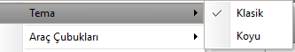
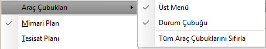
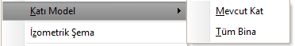
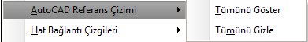
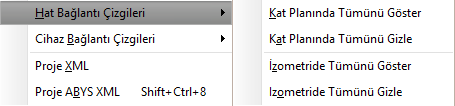
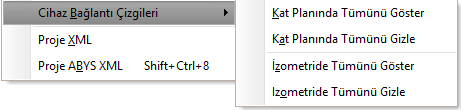

## Görünüm Menüsü  

|<h4 style="color:#2E7D32;">Menü Ögesi|<h4 style="color:#2E7D32;">Tanım|
|:---|:---|
|**Tema**||
||**Klasik** Zetacad, Açık renk tonunda görüntülenir.|
||**Koyu** Zetacad, koyu renk tonunda görüntülenir.|
|**Araç Çubukları**||
||**Üst Menü**  üst menü çubuğunu gösterip gizler|
||**Durum Çubuğu**  durum çubuğunu gösterip gizler|
||**Tüm Araç çubuklarını sıfırla**  tüm araç çubuklarını sıfırlayarak varsayılan duruma getirir.|
|**Mimari plan**|Çalışma modunu mimari plana geçirir.|
|**Tesisat planı**|Çalışma modunu tesisat planına geçirir.|
|**Proje**|Çalışma modunu proje moduna geçirir.|
|**Detay penceresi**|Detay pencresini gösterir.
|**Vaziyet planı**|Vaziyet planını açar.|
|**Katı Model**||
||**Mevcut Kat**  Aktif katın 3 boyutlu görüntüsünü oluşturur.|
||**Tüm bina**  Tüm binanın 3 boyutlu görüntüsünü oluşturur.|
|**İzometrik Şema**|İzometrik şema görüntüleme formunu açar.[Örnek](../../assets/resimler/izometrikSemaOrnek.png)||
|**Proje kapağı**|Proje kapağını görüntüler.[Örnek](../../assets/resimler/kapakOrnek.png)||
|**Cihaz bildirim Formu**|Projedeki tüm birimleri ve  bu birimlerde kullanılan cihazları  bazı özellikleriyle birlikte listeler. [Örnek](../../assets/resimler/cihazBildirimFormu.png)|
|**Proje detayları**|Proje detaylarını görüntüler.[Örnek](../../assets/resimler/projeDetaylari.png)||
|**Standartlar Tablosu**|Projede kullanılan tüm nesnelerin   hangi standardı temel alacağını gösteren  tabloyu görüntüler.[Örnek](../../assets/resimler/standartlarTablosu.png)||
|**Autocad Referans Çizimi**||
||**Tümünü Göster** DXF olarak import edilen proje  arka planda görünür olması için seçilir.|
||**Tümünü Gizle** DXF olarak import edilen proje  arka planda gizlemek için seçilir.|
|**Hat Bağlantı Çizgileri**||
||**Kat Planında Tümünü Göster** Tüm hatlar için, hat ile hat etiketi arasındaki  bağlantı çizgilerini kat planında gösterir.|
||**Kat Planında Tümünü Gizle** Tüm hatlar için, hat ile hat etiketi arasındaki  bağlantı çizgilerini kat planında gizler.|
||**İzometride Tümünü Göster** Tüm hatlar için, hat ile hat etiketi arasındaki  bağlantı çizgilerini izometride gösterir.|
||**İzometride Tümünü Gizle** Tüm hatlar için, hat ile hat etiketi arasındaki  bağlantı çizgilerini izometride gizler.|
|**Cihaz Bağlantı Çizgileri**||
||**Kat Planında Tümünü Göster** Tüm cihazlar için, cihaz ile cihaz etiketi arasındaki  bağlantı çizgilerini kat planında gösterir.|
||**Kat Planında Tümünü Gizle** Tüm cihazlar için, cihaz ile cihaz etiketi arasındaki  bağlantı çizgilerini kat planında gizler.|
||**İzometride Tümünü Göster** Tüm cihazlar için, cihaz ile cihaz etiketi arasındaki  bağlantı çizgilerini izometride gösterir.|
||**İzometride Tümünü Gizle** Tüm cihazlar için, cihaz ile cihaz etiketi arasındaki  bağlantı çizgilerini izometride gizler.|
|**Proje XML**|Projenin XML dosyasını oluşturur|
|**Proje ABYS XML**|Projenin, Gaz dağıtıma gönderilecek XML dosyasını oluşturur|
