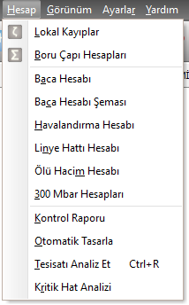

  
## Hesap Menüsü 

|<h4 style="color:#2E7D32;">Menu Ögesi|<h4 style="color:#2E7D32;">Tanım|
|:---|:---|
|**Lokal kayıplar**|Lokal kayıplar formunu açar.|
|**Boru çapı hesapları**|Boru çapı hesap formunu açar.|
|**Baca Hesabı**|Baca hesap formunu açar.|
|**Baca Hesabı Şeması**|Baca hesabındaki verilerin baca şeması üzerinde gösterildiği şemayı açar.|
|**Havalandırma Hesabı**|Havalandırma hesap formunu açar.|
|**Linye Hattı Hesabı**|Linye hattı hesap formunu açar.|
|**Ölü hacim Hesabı**|Ölü hacim hesap formunu açar.|
|**300 mbar hesapları**|300 mbar hesap formunu açar.|
|**Kontrol Raporu**|Tüm projeyi şartname şartlarına göre kontrol eder.|
|**Otomatik tasarla**|Hat çaplarını optimum seviyede tasarlar.|
|**Tesisatı Analiz Et**|Hat çaplarını optimum seviyede tasarlar.|
|**Kritik hat analizi**|Kritik hatları analiz etmek için, kritik hat formunu açar.|
