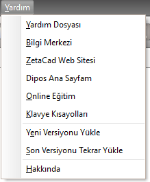

## Yardım Menüsü  

|<h4 style="color:#2E7D32;">Menü Ögesi|<h4 style="color:#2E7D32;">Tanım|
|:---|:---|
|**Yardım dosyası**|Bu yardım dosyasını açar.|
|**Bilgi Merkezi**|Zetacad duyurularının yepıldığı duyuru panelini açar.|
|**Zetacad Web sitesi**|www.zetacad.com sitesini tarayıcıda açar.|
|**Dipos ana sayfam**|dipos işlemleri için web.dipos.com.tr sitesini tarayıcıda açar.|
|**Online Eğitim**|Zetacad dosyaları için [Zetacad akademi](www.dipos.com.tr/zetacad/akademi) sitesini tarayıcıda açar.|
|**Klavye Kısayolları**|[Kısayolların](../arayuz-elemanlari/kisayollar.md) olduğu bir dokuman açar|
|**Yeni Versiyonu Yükle**|Programı güncel versiyona yükseltir.|
|**Son Versiyonu Tekrar Yükle**|Güncel versiyonu yeniden indirerek tekrar yükler.|
|**Hakkında**|Programın hakkında penceresini açar.|