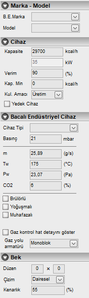

# Bacalı Endüstriyel Cihaz Özellikleri
  
   

**Cihaz Tipi :** Endüstriyel cihazın tipi belirlenir. Konveksiyonlu fırın, Çay ocağı, Buhar kazanı, Kızgın yağ kazanı, Ram makinası, Baskı makinası vs. gibi

**Marka :** Bu açılır kutudan cihaz markasını seçiniz. 

**Model :** Marka seçiminden sonra model bilgisi de gazmerden alınacaktır. oradan seçebilirsiniz. 

**Kapasite :** Cihazın kapasitesini kcal/saat cinsinden giriniz. 300 den küçük değerleri doğrudan m³ olarak değerlendirerek kendisi kcal/h değerine çevirir. 

**Verim** burada cihazın kataloğunda yazan verim değeri 100 lük birimde verilir. 0,9 görünen değeri 90 olarak girebilirsiniz.

**Kap. Min :** Cihaz kataloğunda minimum kapasite verilmişse buradan girilebilir.

**Kul. Amacı :** Cihazın evsel ya da üretim amaçlı kullanılacağı buradan seçilir.

**Yedek Cihaz :** Cihaz gaz açımında yerinde olmayacaksa bu seçenek işaretlenir

**m :** Kazan atık gaz kütlesel debisi (baca hesabında kullanılmaktadır)

**Tw :** Kazan atık gaz sıcaklığı (baca hesabında kullanılmaktadır)

**Pw :** Isı üreticisi için gerekli itme basıncı (baca hesabında kullanılmaktadır)

**CO2 :** Hacimce Karbondioksit oranı (baca hesabında kullanılmaktadır)

