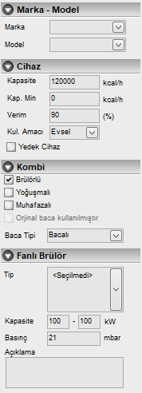

# Büyük Kombi Özellikleri
  
   

**Marka :** Bu açılır kutudan cihaz markasını seçiniz. 

**Model :** Marka seçiminden sonra model bilgisi de gazmerden alınacaktır. oradan seçebilirsiniz. 

**Kapasite :** Cihazın kapasitesini kcal/saat cinsinden giriniz. 300 den küçük değerleri doğrudan m³ olarak değerlendirerek kendisi kcal/h değerine çevirir. 

**Verim** burada cihazın kataloğunda yazan verim değeri 100 lük birimde verilir. 0,9 görünen değeri 90 olarak girebilirsiniz.

**Yedek Cihaz :** Cihaz gaz açımında yerinde olmayacaksa bu seçenek işaretlenir

**Fanlı brülör özellikleri :** fanlı brülörün tipi belirlenmelidir. Tek kademe, çift kademe, oransal gibi. aynı alanda brülörün min max kapasite aralığı ve basınç bilgisi de verilebilir. 

