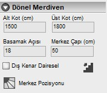

# Dönel Merdiven Özellikleri

   
  
**Alt Kot :** Merdivenin başlangıç kotunu cm cinsinden giriniz.   

**Üst Kot :** Merdivenin üst kotunu cm cinsinden giriniz.   

**Basamak Açısı :** Merdivenin basamak açısını derece cinsinden giriniz.   

**Merkez Çapı :** Merdiven merkez çapını cm cinsinden giriniz.   

**Dış Kenar :** Merdiven dış kenarının dairesel olup olmadığını belirleyiniz.   

**Çıkış Hattı**  : Merdivenin çıkış istikametini belirleyiniz.   

**Merkez Pozisyonu:** Merdiven merkezinin bulunduğu konumu seçiniz.   
  
