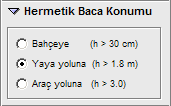

# Hermetik Baca Özellikleri

   

Hermetik bir cihaz seçiliyken, cihaz özellikleri paneline ek olarak bu
**Hermetik Baca Konumu** paneli açılır. 

Zemin ve Bodrum katlarda atmosfere verilen atık gaz borusunun çıkış konumunu buradaki seçeneklerden belirleyiniz. Burada seçtiğiniz seçenek sizin bir beyanınız olarak projede gösterilir. Bu panel sadece zemin veya bodrum katlarda bulunan hermetik cihazlar için açılır.

  
