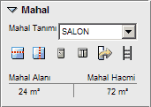

# Mahal Özellikleri

  
  
**Mahal Tanımı :** Bu açılır kutudan mahalin ne olduğu belirlenir.   

**Mahal Alanı :** Burada mahalin alanını görebilirsiniz.   

**Mahal Hacmi :** Burada mahalin hacmini görebilirsiniz.   
  
**İşlem Butonları :**

-  Mahali Yatay Böl 

-  Mahali Dikey Böl 

-  Mahale Kapı Aç   

-  Mahale Pencere Aç 

-  Mahale Menfez Aç 

-  Mahale Merdiven Ekle  

   