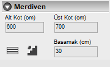
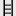

# Merdiven Özellikleri

   
  
**Alt Kot :** Merdivenin başlangıç kotunu cm cinsinden giriniz.   

**Üst Kot :** Merdivenin üst kotunu cm cinsinden giriniz.   

**Basamak :** Merdivenin basamak genişliğini cm cinsinden giriniz. 

**Merdiven Konumu**  : Merdivenin yatay veya dikey yerleşimini belirleyiniz.   

**Çıkış Hattı**  : Merdivenin çıkış istikametini belirleyiniz.   

  
