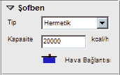

# Şofben Özellikleri

   
  
**Marka :** Bu açılır kutudan şofben markasını seçiniz. 

**Model :** Marka seçiminden sonra model bilgisi de gazmerden alınacaktır. oradan seçebilirsiniz. 

**Kapasite :** Cihazın kapasitesini kcal/saat cinsinden giriniz. Standart şofben kapasitesi 18150 kcal/h değerlerindedir.

**İkinci El Cihaz :** İkinci el cihaz kullanılmışsa bu seçenek işaretlenmelidir.

**Yedek Cihaz :** Cihaz gaz açımında yerinde olmayacaksa bu seçenek işaretlenir

  
  
  
