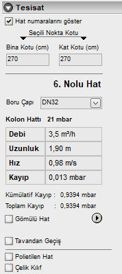

# Tesisat Özellikleri

  
**Hat Numaraları:** Bu seçenekle hat numaralarını proje üzerinde gizleyip/gösterebilirsiniz.   

**Seçili Nokta Kotu :** Tesisatta aktif noktanın binada yada mevcut kattaki kotunu görebilir ve değiştirebilirsiniz.  

**Hat No :** Seçili hattın numarasını görebilirsiniz.   

**Boru Çapı :** Boru çapını listeden seçebilirsiniz

**Tesisat Değer Tablosu:** Bu tabloda aktif hatta ilişkin değerleri okuyabilirsiniz.   

**Kümülatif Kayıp:** Bu değerde tesisatın seçili hatta kadar (seçili hat dahil) olan kaybını okuyabilir ve kayıp takibini daha düzenli yapabilirsiniz.   

**Gömülü Hat :** Eğer hattınız toprak altında ise bu seçeneği işaretleyiniz. 

**Ekleme Menüsü :** Bu butona tıklayarak aktif hatta tesisat parçası (vana,sayaç vb) ekleyebelirsiniz..   
  
**Polietilen Hat :** Eğer Çelik boru yerine polietilen boru ile tesisat yapılıyorsa bu seçenek işaretlenmelidir.
  
**Çelik kılıf :** Hattınız çelik kılıf içinde ise bu seçenek işaretlenmelidir. 

   