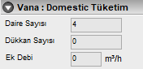
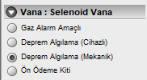

# Vana Özellikleri

   
  
**Vana Tipi :** Bu açılır kutudan vana tipini belirleyebilirsiniz. Şu değerler mevcuttur. Ana Kesme , Tüketim (Ağız), Cihaz,Eminiyet, Yan Bina.   
  
**Vana Çapı :** Vana çapına hat çapından başka bir çap vermek isterseniz bu açılır kutudan çapı mm cinsinden belirleyiniz.   

**Flanşlı Vana :** Vana eğer flanşlı ise bu seçeneği işaretleyin.

**Muhafazalı :** Vana eğer muhafazalı ise bu seçeneği işaretleyin.  
 
  
  
  
  
Vana Tipine Göre, Vana Ek Özellikleri belirebilir.   
  

## AKV   

   
  
**Toplam Debi :** Burada Ana Kesme vanasının kontrol ettiği birimlerden kaynaklanan toplam yükü görebilirsiniz.   

**Ağız bırakılmayan ek dükkan sayısı :** Eğer AKV den sonra ağız bırakılmayan dükkanlar var ve onların yüklerinin de toplam kapasiteye ve bina bağlantı hattına dahil olması için , buraya sayıyı girebilirsiniz.

**Ek Debi :** Tesisatın yükünü yüksek hesaplayarak boru çaplarını ilerde olası bir tadilat durumunda tesisatta değişiklik yapmayı gerektirmeyecek şekilde hazır durumda tutabilirsiniz.
  
  
  
  
  
  
## Tüketim

   
  
**Birim:** Burada birimin daire, dükkan, kazan vs hangi tipte olduğunu seçebilirsiniz.

**Birim No:** Bu kutuya tüketim vanasının hizmet verdiği bağımsız birimin kapı numarasını yazınız.

**Tüketim :** Buraya tüketimin miktarını yazabilirsiniz. varsayılan değeri 3.5 dur. 

**Tüketim No:** İlgili birimin ABYS deki abone nosudur. 

**Müstakbel Tüketim :** İlerde mimariye bir birim ilavesi eklenmesi göz önüne alınarak önceden bırakılan vanadır. 

**Vana yükü aritmetik toplam :** Bu vananın yükü toplam kapasiteye doğrudan ilave edilecektir. 
  
  
  
  
## Yan Bina

   
  

**Daire Sayısı:** Yan bina vanasının hizmet verdiği daire sayısını giriniz.

**Dükkan Sayısı:** Yan bina vanasının hizmet verdiği dükkan sayısını giriniz. 

**Tesisat No:** Yan binanın servis hattı kayıt numarasını giriniz.   

**Ek Debi :** Eğer yan binada birim sayısından oluşan debinin haricinde ek bir tüketim var ise bu değeri Ek Debi kutusuna giriniz.  
 

  
  
## Domestik

   
  

**Daire Sayısı:** domestik vananın hizmet vereceği daire sayısını giriniz.

**Dükkan Sayısı:** domestik vananın hizmet vereceği daire sayısını giriniz.

**Ek Debi :** Eğer domestik vanada birim sayısından oluşan debinin haricinde ek bir tüketim var ise bu değeri Ek Debi kutusuna giriniz.  
 

## Selenoid

   
  

**Gaz Alarm Amaçlı:** Selenoid vana gaz alarm cihazıyla irtibatlı ise bu seçenek işaretlenmelidir.

**Deprem Algılama (cihazlı):** Selenoid vana deprem algılama cihazına bağlı olarak bir deprem anında cihazdan aldığı sinyalle gazı kesmek üzere konulmuşsa bu seçenek işaretlenmelidir. 

**Deprem Algılama (mekanik):** mekanik deprem vanasını temsilen konulmuşsa bu seçenek işaretlenmelidir. 

**Ön ödeme kiti:** Selenoid vana ön ödeme kiti amacıyla konulmuşsa ise bu seçenek işaretlenmelidir.
  
