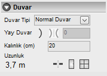

# Duvar Özellikleri

**Duvar Özellikleri**
  
   

**_Duvar Tipi :_** Bu açılır kutudan duvarın tipi seçilir. Duvar tipi şu değerlerden biri olabilir.   

!!! tip duvar tipleri
    Normal Duvar 
    Açık Duvar
    Camekan
    Balkon Duvarı   

**_Yay Duvar :_** Bu buton basılıyken duvar dairesel olarak çizilir.  

**_Yayı Tersle :_** Bu butona basılarak yay duvarın açıklığı tersinlenir.   

**_Yay Açısı :_** Yay duvarın açısını belirler.   

**_Uzunluk :_** Burada duvarın uzunluğunu görebilirsiniz.   

**_İşlem Butonları :_**

 Duvarı Böl 
 Kapı Ekle 
 Pencere Ekle 

  
