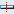
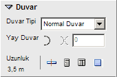

# Duvar Özellikleri

**Duvar Özellikleri**
  
**_Duvar Tipi :_** Bu açılır kutudan duvarın tipi seçilir. Duvar tipi şu değerlerden biri olabilir.   
Normal Duvar - Açık Duvar - Camekan - Balkon Duvarı   
**_Yay Duvar :_** Bu buton basılıyken duvar dairesel olarak çizilir.   
**_Yayı Tersle :_** Bu butona basılarak yay duvarın açıklığı tersinlenir.   
**_Yay Açısı :_** Yay duvarın açısını belirler.   
**_Uzunluk :_** Burada duvarın uzunluğunu görebilirsiniz.   
**_İşlem Butonları :_** Duvarı Böl  Kapı Ekle  Pencere Ekle Kolon Ekle   
|     
  
