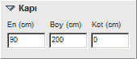

# Kapı Özellikleri

**Kapı Özellikleri**
  
**_En :_** Kapının genişliğini cm cinsinden belirleyebilirsiniz.   
**_Boy :_** Kapının yüksekliğini cm cinsinden belirleyebilirsiniz.   
**_Kot :_** Eğer kapı zeminden yukarıda ise, cm cinsinden kot verebilirsiniz.   
  
|     
  
