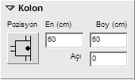

# Kolon Özellikleri

**Kolon Özellikleri**
  
**_Pozisyon:_** Bu panelden kolonun duvardaki yerleşimini belirleyebilirsiniz.   
**_En :_** Kolonun genişliğini cm cinsinden belirleyebilirsiniz.   
**_Boy :_** Kolonun boyunu cm cinsinden belirleyebilirsiniz.   
**_Açı :_** Kolonun merkezi etrafındaki açısal konumunu belirleyebilrisiniz.   
  
|     
  
---|---