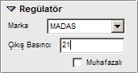

# Regülatör Özellikleri

**Regülatör Özellikleri**
  
**_Marka :_** Regülatörün markasını seçiniz.   
**_Muhafazalı :_** Regülatör muhafaza içinde ise bu seçeneği işaretleyiniz.   
**_Çıkış Basıncı :_** Çıkış basıncını mbar cinsinden giriniz. Böylelikle regülatçrün servis verdiği hatlarda bu basınç etkin olacaktır.   
  
  
  
|     
  
