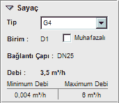

# Sayaç Özellikleri

**Sayaç Özellikleri****  
** |      
---|---  
  
**_Tip :_** Bu açılır kutudan sayaş tipini seçiniz. Mevcut değerler G4,G6,G10,G16,G25,G40,G65   
**_Birim :_** Sayacın hizmet verdiği birimi burada görebilirsiniz. Değiştirmek için sayaca bağlı tüketim vanasının özelliklerini kullanmalısınız.   
**_Muhafazalı :_** Sayaç muhafaza içinde ise bu seçeneği işaretleyiniz.**_  
Bağlantı Çapı : _**Burada sayaç tipine göre değişen bağlantı çapını görebilirsiniz. Eğer sayaca bağlı hat bu çaptan farklı ise hesaplarda otomatik redüksiyon kullanılır   
**_Debi :_** Sayaç üzerinden geçen aktif tüketim değerini görebilirsiniz.   
**_Min-Max Debi :_** Şartnamede but ip sayaç için izin verilen en düşük ve en yüksek debi değerlerini görebilirsiniz.   
  
|     
  
---|---