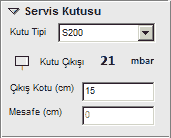

# Servis Kutusu Özellikleri

**Servis Kutusu Özellikleri**
  
**_Kutu Tipi:_** Servis kutusunun tipini bu açılır kutudan belirleyiniz. Mevcut değerler şunlardır. S200 , S300 , CES200.   
**_Kutu çıkışı :_** Kutu çıkış yönünü seçiniz.   
**_Servis Basıncı :_** Kutu servis basıncını belirleyiniz. 21 mbar, 300 mbar.   
**_Çıkış kotu :_** Kutudan tesisatın çıktığı kotu cm cinsinden belirleyiniz. Böylelikle kutu kotuda belirlenmiş olurç   
**_Mesafe :_** CES200 kutular için kullanılır. Kutunun bağlı bulunduğu duvardan açıklığını cm cinsinden giriniz.   
  
|     
  
