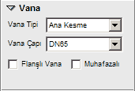
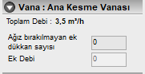
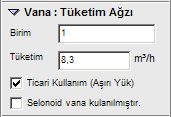
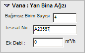

# Vana Özellikleri

**Vana Özellikleri****  
** |      
---|---  
  
**_Vana Tipi :_** Bu açılır kutudan vana tipini belirleyebilirsiniz. Şu değerler mevcuttur. Ana Kesme , Tüketim (Ağız), Cihaz,Eminiyet, Yan Bina.   
  
**_Vana Çapı :_** Vana çapına hat çapından başka bir çap vermek isterseniz bu açılır kutudan çapı mm cinsinden belirleyiniz.   
**_Flanşlı Vana :_** Vana eğer flanşlı ise bu seçeneği işaretleyin.   
**_Muhafazalı :_** Vana eğer muhafazalı ise bu seçeneği işaretleyin.   
|     
  
---|---  
  
  
_Vana Tipine Göre, Vana Ek Özellikleri belirebilir._   
  
**Vana Tipi; AKV ise :**   
  
**_Toplam Debi :_** Burada Ana Kesme vanasının kontrol ettiği birimlerden kaynaklanan toplam yükü görebilirsiniz.   
**_Ek Debi :_** Eğer AKV den sonra ağız bırakılmayan dükkanlar var ve onların yüklerinin de, toplam kapasiteye ve bina bağlantı hattına dahil olması için , ek debi seçeneğini kullanınız.   
  
|     
  
---|---  
  
  
  
**Vana Tipi; Tüketim ise :**   
  
**_Birim :_** Bu kutuya tüketim vanasının hizmet verdiği bağımsız birimin kapı numarasını yazınız. Dükkanlar için kapı numarasını 900x şeklinde yazınız.   
**_Tüketim :_** Buraya tüketimin miktarını yazabilirsiniz. varsayılan değeri 3.5 dur. Birim içindeki kullanım 5.0 ı geçerse bu değer de otomatik olarak değişir.   
**_Ticari Kullanım :_** Eğer tüketim eş zamanlı değilse, yani ticari amaçlı sürekli tüketim varsa, bu seçenği işaretleyin. Böylelikle tüketim miktarı toplama aritmatik olarak dahil olacaktır.   
**_Selonoid Vana :_** Eğer tüketim vanasından sonra selenoid vana kullanılmışsa bu seçeneği işaretleyiniz.   
|     
  
---|---  
  
  
**Vana Tipi; Yan Bina ise :**   
  
**_Birim Sayısı:_** Yan bina vanasının hizmet verdiği birim sayısını giriniz. Böylelikle tüketim otomatik hesaplanacaktır.   
**_Ek Debi :_** Eğer yan binada birim sayısından oluşan debinin haricinde ek bir tüketim var ise bu değeri Ek Debi kutusuna giriniz.   
**_Tesisat No:_** Yan binanın servis hattı kayıt numarsını giriniz.   
|     
  
---|---