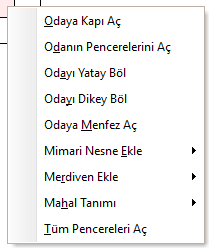
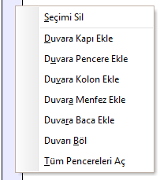
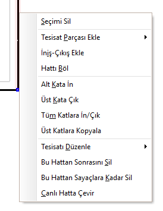

# Sağ Tuş Menüsü

**Sağ Tuş Menüsü****  
** |      
---|---  
  
Zetacad tasarım ortamında herhangi bir nesneye veya konuma farenizin sağ tuşu ile basığınızda bir çok Windows uyumlu programda olduğu gibi bir sağ tuş menüsü açılacaktır. Bu menüye PopUp menü veya İçerik Menüsü ismi de verilir.   
  
Zetacad içerik menüsü açılırken , seçili olan nesneyi dikkate alarak içeriğini düzenler.   
  
   
  
_Seçimi Sil_   
|  Seçili olan nesneyi siler.   
  
---|---  
_Odaya Kapı Aç_   
|  Diğer mahallerden seçili mahale kapılar açar. Odalardan koridora kapıları açmak için kullanılır.   
  
_Odanın Pencerelerini Aç_   
|  Seçili mahalin atmosfere bakan duvarlarına pencere nesnesi yerleştirir.   
  
_Odayı Yatay Böl_   
|  Seçili mahalin ortasına yatay duvar yerleştirir.   
  
_Odayı Dikey Böl_   
|  Seçili mahalin ortasına dikey duvar yerleştirir.   
  
_Odaya Menfez Aç_   
|  Seçili mahalin atmosfere bakan duvarına menfez açar.   
  
_Odaya Alarm Cihazı Ekle_   
|  Seçili mahalin bir duvarına alarm cihazı yerleştirir.   
  
_Mahal Tanımı_   
|  Seçili mahali tanımlamak için seçenekler sunar (Banyo, Mutfak vb.)   
  
_Tüm Pencereleri Aç_   
|  Mimari planın tüm atmosferik duvarlarına pencere yerleştirir.   
  
_Tüm Kolonları Oluştur_   
|  Mimari planın tüm duvar birleşmlerine kolon yerleştirir.   
  
_Duvara Kapı Ekle_   
|  Seçili duvara kapı yerleştirir.   
  
_Duvara Pencere Ekle_   
|  Seçili duvara pencere yerleştirir.   
  
_Duvara Kolon Ekle_   
|  Seçili duvarın iki köşesine kolon yerleştirir.   
  
_Tesisat Parçası Ekle_   
|  Seçili hattın ucuna vana,cihaz vb. tesisat parçalarını ekler.   
  
_Hattı Böl_   
|  Seçili hattı iki eşit boru parçasına böler (Ctr+T)   
  
_Tesisatı Kaydır_   
|  Seçili noktadan itibaren tesisatı verilen miktar kadar sağa,sola,ileri veya geri kaydırır.   
  
_Hat parçasını kaçır_   
|  Birbirini örten hat parçalarını gösterebilmek için, seçili olan hat parçasını kaçık çizer.   
  
_Üst kata çık_   
|  Seçili noktandan itibaren yukarı doğru kat kotu kadar hat ekler.   
  
_İzometrik çizim oranı_   
|  Seçili hattın izometirk şemada olduğundan daha kısa veya uzun çizilmesini sağlar.   
  
_Sayaca bağlı iç tesisatı sil_   
|  Seçili sayaçtan sonraki daire içi tesisatı siler.   
  
_Sayaca bağlı iç tesisatı izometride gizler_   
|  Seçili sayaçtan sonraki daire içi tesisatı verilen başka bir daire ile aynı olduğu için izometrik şemada çizmez.   
  
  
|