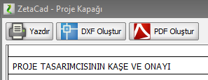
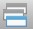
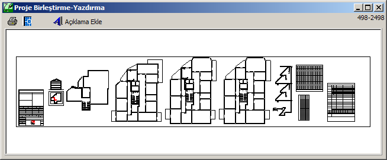

# Baskı

Projeyi yazdırmak için kendi yazıcınızı kullanabilirsiniz veya piyasada bası işini yapan bürolar vasıtasıyla yazdırabilirsiniz. Kendi yazıcınız veya plotter cihazınız aracılığıyla bastırmak için ilgili yerlerdeki **Yazdır**  butonuna bastığınızda karşınıza standart windows yazdırma diyaloğu çıkar. Bu diyalog aracılığıyla aktif unsuru yazıcınıza gönderebilirsiniz.  

Eğer baskı işini dışarıda halletmek istiyorsanız **DXF oluştur** butonuna tıkladığınızda standart windows kaydet diyaloğu açılacaktır. Bu diyalog aracılığıyla bastırmak istediğiniz unsuru DXF dosya formatında bilgisayarınızda istediğiniz yere kaydedin ve bu dosyayı baskı ofisine ulaştırın.   
  
  
**Kısmi Baskı**

Projenin sadece bir usnurunu basmak veya PDF, DXF oluşturmak için ilgili yerdeki Yazdır ve DXF Oluştur butonlarına tıklayınız. Vaziyet planı, proje kapağı, hesap formları, izometrik şema gibi pencereler açıkken size o pencerenin içeriğini basmak veya PDF, DXF formatına dönüştürmek için butonlar sunar. Bu butonlar aracılığıyla kısmi baskıyı gerçekleştirebilirsiniz. Bununla beraber, proje ortamında sadece aktif katı basmak için araç çubuğunda bulunan Yazdır, PDF, DXF Oluştur butonlarını kullanınız.   

  
**Proje Baskısı - Birleştir Komutu**

Bir projeyi tüm unsurlarıyla, gaz dağıtım şirketinin istediği normlarda basmak için **Birleştir**  komutu kullanılır. Bunun için **Dosya** menüsünden **Birleştir** komutunu tıklayınız. Açılan pencerede tüm projenizi bir arada göreceksiniz. Birleştirme penceresinde **Yazdır** ve **DXF oluştur** butonlarına basıldığında tüm projeniz yazdırılır veya DXF dosya formatında kaydedilir.   
  

