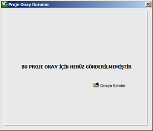
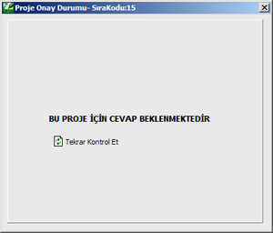
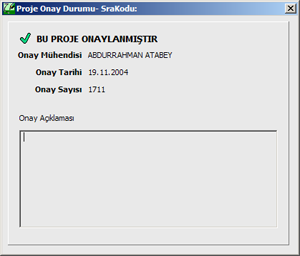
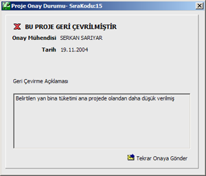

# Dijital Onay

**Dijital Onay**
  
Eğer gaz dağıtım şirketiniz ile Tekhnelogos arasında bir anlaşma yapılmışsa, projelerinizi programın arayüzünden onay için digital ortamda gaz dağıtım şirketine gönderebilir ve onay durumunu buradan takip edebilirsiniz.   
  
Bu durumda, programın _Proje_ menüsündeki _Proje Onay_ seçeneğine tıkayarak Oany formunu açabilirsiniz.   
  
Bir projenin 4 onay durumu vardır.   
  
**0\. Proje henüz onaya gönderilmemiş :** Bu durumda onay formu size projenizi (internet üzerinden) onaya gönderme imkanı sunar.   
  
|  **1\. Proje onaya gönderilmiş:** Bu durumda projniz onay için cevap bekleme modundadır ve onay formu size onay durumunu (cevabı) öğrenme imkanı sunar.   
  
  
   
  
  
  
   
  
**2\. Proje onaylanmış:** Projeniz onaylı olduğu için artık süreç tamamlanmıştır, ve Zetacad o proje üzerinde değişiklik yapmaya izin vermez. Ayrıca digital imzalı versiyonlarda onaylanmış proje üzerinde gaz dağıtım şirketinin ve mühendislerinin digital imzaları vardır.   
  
|  **3\. Proje reddedilmiş:** Projeniz Zetacad tarafından onaylandığı halde, gaz dağıtim şirketi tarafından özel bir nedenle reddedilebilir. Bu durumda onay formu size hem red gerekçesini sunar, hemde düzeltme yaptıktan sonra, tekrar onaya gönderme imkanı sunar.   
  
   
   
  
  
  
  
  
  
  
  
  
**  
**