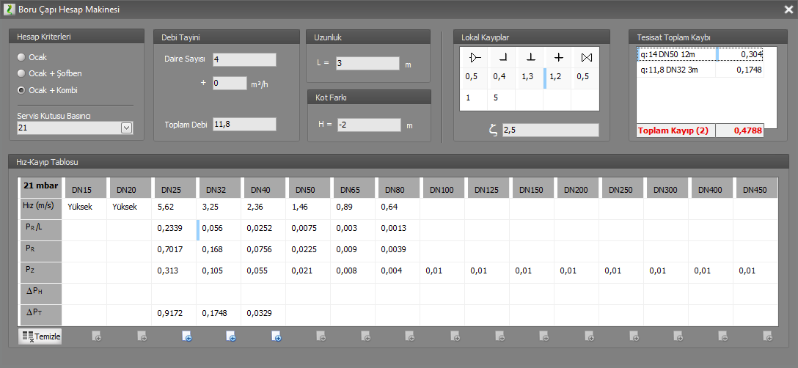

# Eskiz Çalışması

**Eskiz Çalışması**
  
Eskiz Çalışması, diğer adıyla **Boru Çapı Hesap Makinası,** özelleştirilmiş bir hesap makinası gibi düşünülebilir. Bu formda projenizden bağımsız olarak çeşitli basınç, yük ortamlarında, tüm boru çapı değerlerinde, ne tür sonuçlar elde edebileceğinizi görebilirsiniz. Tesisatınızi Zetacad'e değil de,kendiniz tasarlamak isterseniz, eskiz çalışması formu size çok yardımcı olacaktır.   
  
**Araçlar** menüsünen **Eskiz Çalışması** seçeneğine tıklayarak açacağınız bu pencerede;   
  
Hesap makinasının size doğru sonuçlar üretebilmesi için bazı giriş verilerini sağlamanız gerekmektedir.   
  
**Isınma Tipi :** Öncelikle hesabın faydanacağı ısınma tipini belirleyiniz. Varsayılan değer Ocak+Kombi dir.   

**Hat Basıncı:** Hat üzerindeki basıncı kutudan seçiniz veya elle yazınız. Bu değer 21 ile 300 mbar arasında herhangi bir değer olabilir.   

**Debi:** İsterseniz hat üzerindeki debiyi, Toplam Debi kutusuna yazınız, isterseniz daire sayısı ve ek yükleri girerek debinin otomatik hesaplanmasını sağlayınız.   

**Uzunluk:** Hat uzunluğunu metre cinsinden giriniz. Varsayılan değer 1 metredir.   

**Kot Farkı:** Kot farkını metre cinsinden giriniz.   

**Lokal Kayıplar:** Eğer hesaba lokal kayıpları dahil etmek isterseniz, tesisatta bulunan parçaların sayılarını giriniz veya Zeta kutusuna doğrudan Zeta katsayılar toplamını yazabilirsiniz.   
  
   
  
Tüm bu verilerin varsayılan değerleri vardır. Siz ilk yükü belirler belirlemez hesap makinası çalışır ve size tüm çaplarda hız ve basınç kaybı değerlerini oluşturur. Siz tüm çapların değerlerini kıyaslayarak o hat için en ugun çapı belirleyebilirsiniz. 

İsterseniz yaklaşık bir toplam kayıp elde etmek için seçtiğiniz çapların kayıplarını sağ taraftaki listede toplayabilirsiniz. Bunun için seçtiğiniz çapın alt kısmındaki **toplama gönder** butonuna basınız. Toplam listesini temizlemek için **Temizle** butonuna basınız. Ayrıca toplam listesinde istediğiniz satır seçiliyken klavyeden DEL tuşuna basarak listeden silebilirsiniz. Toplam liste içinde değişiklik oldukça alt ksımda **Toplam Kayıp** değeri güncellenir.