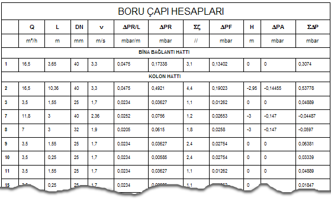
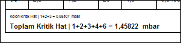

# Boru Çapı Hesapları

**Boru Çapı Hesapları**
  
Boru çapı değerlerini gösteren aşağıdaki hesap tablosuna ulaşmak için _Hesap_ menüsünden _Boru çapı hesapları_ seçeneğini tıklayın. Ortaya çıkan tabloda, o andaki tesisat tasarımında otomatik oluşan tüm değerler kullanılarak hesaplanan boru çapı hesap değerleri gösterilir. Aynı tabloya [araç çubuğu](butonlar.htm) üzerindeki  butona tıklayarak da girebilirsiniz.   
  
   
  
Aynı tablonun alt kısmında ise en kritik hatlar gösterilir.   
  
