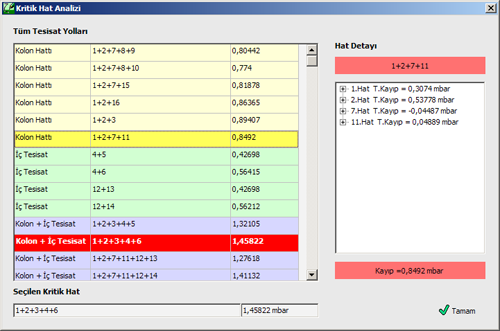
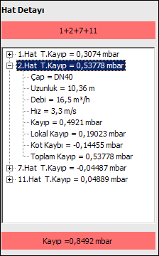

# Kritik Hat Analizi

**Kritik Hat Analizi**
  
Kritik hat analizi sadece en kritik devrenin değerlerini değil, aynı zamanda tesisattaki muhtemel tüm yolların analizini yapabilmemiz için bize ayrıntılı bir pencere sunar. Kritik hat analizinde, Zetacad kritik devreyle birlikte tüm tesisat yollarını kolon,daire içi ve kolon+daire içi olmak üzere listeleler. Her bir tesisat yolunu seçerek o yol üzerindeki tüm hatların değerlerine ulaşabiliriz. Kritik hat analizi bize, kritik devrenin haricinde , kayıp limitlerinin aşılabileceği diğer riskli yolları da görmemizi ve tesiat üzerineki değişiklikleri ona göre yapmamızı sağlar.   
  
Kritik hat analizi formunu açamak için, _Hesap_ menüsünden _Kritik Hat Analizi_ seçeneğini seçiniz. Aşağıdaki from açılacaktır.   
  
   
   
|    
Tüm tesisat yollları başlığı altında, Kolon, İç Tesisat ve Kolon+İç Tesisat olmak üzere gazın takip ettiği tüm devreler kendi grubuna ait renkle yer alır. Kırmızı renkli satır ise Zetacad'in kayıp değerinin maksimum olamsı nedeniyle seçtiği, kritik devreyi göstermektedir. Ayrıca alt kısımda bulunan kutucuklarda seçilen kritik hat ayrıca yazılır. Herhangib bir tesisat yolu seçiliyken, o yolu oluşturan hatlar numaraları ve kayıp değerleriyle sağ tarafta sıralanır. Böylelikle kaybı oluşturan ana hatlar belli olur. Dahası isterseniz ağaç yapısı şeklinde listelenen bu hatları + işaretine basarak açabilir ve yandaki resimde olduğu gibi hatla ilgili daha detaylı bilgiye ulaşabilirsiniz.   
  
---|---